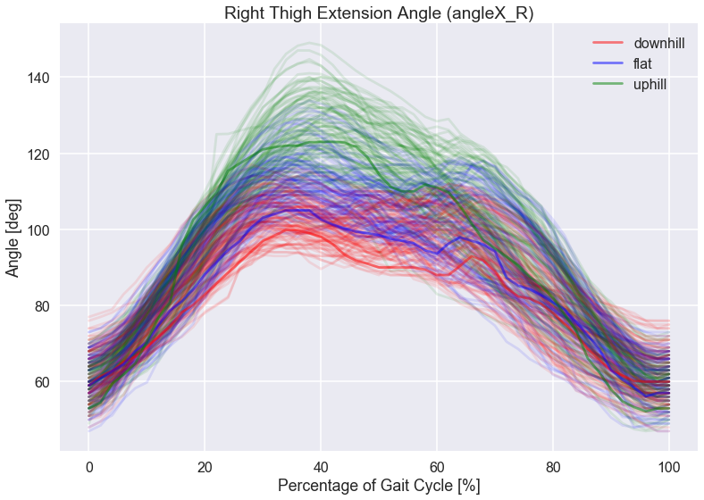
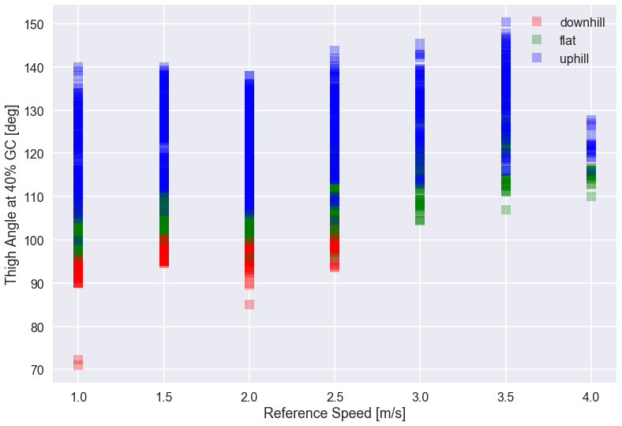
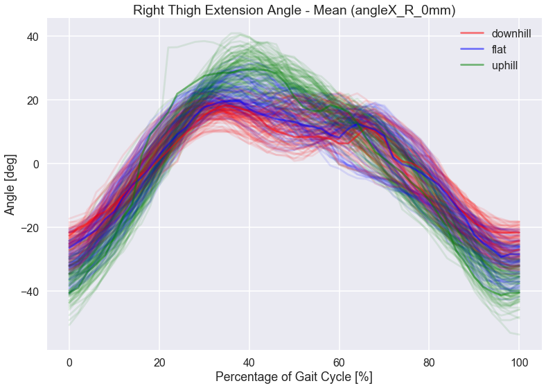
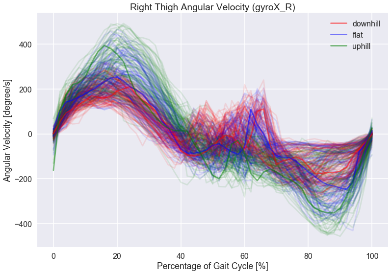
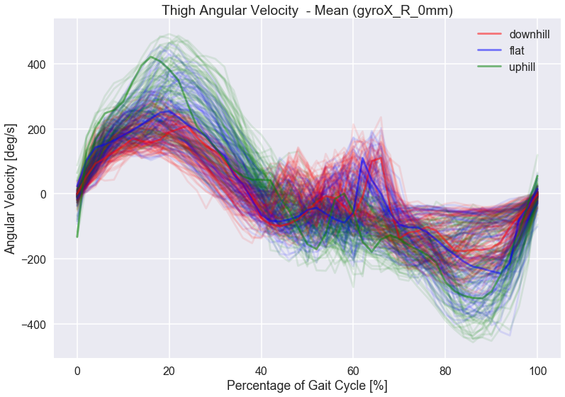
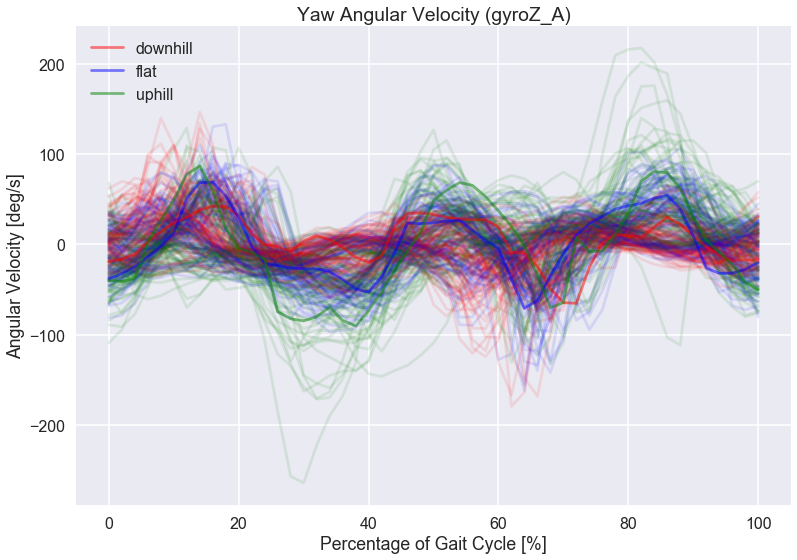
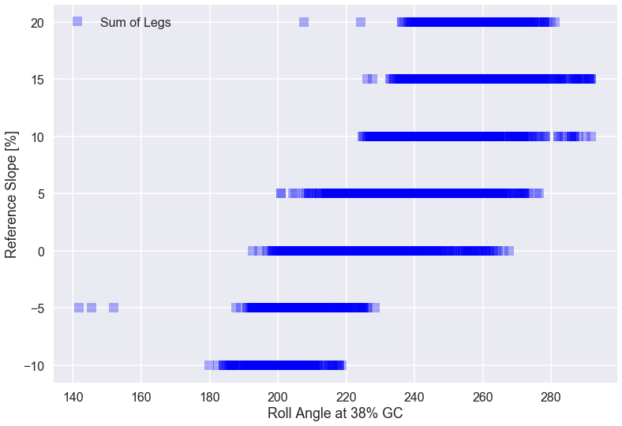
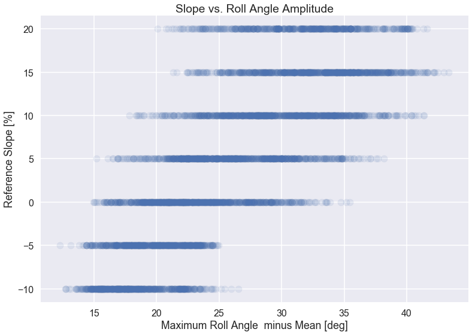

## Contents
{:.no_toc}
*  
{: toc}


## 1. Data Exploration & exploratory data analysis 

### 1) Description of Raw Data

The Stanford Dogs dataset contains images of 120 breeds of dogs from around the world. This dataset has been built using images and annotation from ImageNet for the task of fine-grained image categorization. Contents of this dataset: • Number of categories: 120 • Number of images: 20,580

We will build models to classify dog breed and compare them. The files which we need to perform exploratory data analysis are

http://vision.stanford.edu/aditya86/ImageNetDogs/images.tar

http://vision.stanford.edu/aditya86/ImageNetDogs/lists.tar

The images.tar file have all the images that are needed for our analysis and to create a model.

list.tar file have the list of all files (file_list.mat), list of training set (train_list.mat) and list of test set (test_list.mat)

Once we untar the files we would load the file_list.mat file to get the list of all files that are in the dataset.


Fig 1. Image of dog


During the sloped walking experiments on the treadmill, only certain IMU outputs are selected for streaming. The roll, pitch and yaw angles, angular velocity and linear accelerations were collected. Note the yaw angle is interpreted as heading and measured in the East-North-Up coordinate system, whereas the roll and pitch angles are measured in the local coordinate frame. The sequence of rotation for Euler angles uses the aerospace convention for rotation from global frame to location frame. Referencing the local coordinate frame in Fig. 1, the IMU sensor is worn such that *x* axis is normal to the sagital plane and points medially, *y* axis is normal to the coronal plane and points anteriorially, and *z* axis is normal to the transverse plane and points vertically down.


Fig 3. Image of Xsens IMU from Xsens User Manual

The suit has an algorithm that segments gait cycles using the maximum hip flexion angle, and the percent gait cycle estimates is another data column. There is also a flag to indicate whether the subject is running determined from the acceleration readings from the abdomen IMU; it is numeric rather than binary because it encodes several different flags together.

From the raw system data, we divided the data into strides. We chose to use each stride as
an independent observation. For the IMU data, we divided each angle, angular velocity and
linear acceleration into 50 predictors at every 2% GC. (For instance, ‘Angle X at 24%’ gait cycle
is a separate predictor than ‘Angle X at 26%’ gait cycle.) We also found the maximums and minimums of each angle, angular velocity and linear acceleration, and used them as additional predictors. Finally, the mean of each IMU output are also included as
additional predictors.

In addition to IMU data, we included the subject number, height and weight for each
observation. Subject information are very important for evaluating wearable devices as walking
kinematics may be slightly different for each person. Finally, sloped walking data was also
collected at different walking speeds (1 m/s, 1.5 m/s, ..., 3.5 m/s, 4 m/s), thus walking speed is
another important predictor.

For the outcome variable, the walking slope is collected at discrete slopes of -10%, -5%, 0%,
5%, 10%, 15%, and 20%.

*Note: we used MATLAB to perform data cleaning and to exact and assemble all predictors
mentioned above. We have a total of 1820 predictors and 5006 observations.

### 3) Additional Feature Engineering

After some initial data exploration,  we noticed that the kinematic data seem shifted per subject or testing condition. This is likely due to the inconsistent placement of the wearable sensors during each donning. To compensate for these shifts in data range, we decided to add more predictors of each IMU signal subtracting the mean of that signal during each stride.

We used the orignal column names and added "_mm" (which stand for *minus mean*) for each of these newly engineered predictors. The same subtraction of mean was done to the *max* and *min* values of each predictor.

With these engineered features, we have 3251 predictors in total.

### 4) Further Data Manipulation - Removing predictors

In this third stage of manipuating our data, we decided to remove predictors that are difficult to collect or unreliable during real time data collection of the suit. In order to better minic a real-time slope estimation algorithm, the *angle Z* (or yaw angle), *acceleration x*, and *accleration y* are removed.

Moreover, we decided not to use the *reference slope* as a predictor because of the systems lack of ability to estimate walking speed during overground walking.

Finally, *percentage gait cycle* and *running flag* predictors were removed because of their irrelevance to slope estimation.

After removing these unncessary predictors, we have a total of 1928 predictors.

### 5) Standardization

Because most of our data physical kinematic values, no standardization was required as a natural boundary of reasonable values have been set by body geometry. However, for the need of unbiased regularization and PCA, we standardized the data when using those methods

-------------------

## 2. EDA

### 1) EDA for 3-Class Classification (flatground, uphill, downhill)

Methods for Initial Data Exploration:
First for our classification problem, we split the data into three sets - flat ground, uphill, and downhill, denoted by class 0, class 1 and class -1 respectively. We plotted the IMU data of each gait cycle (50 features per gait cycle), and compared the three groups against each other.


```python
### 1. READING DATA
df = pd.read_csv('Data/dataAll_csv8_withMM.csv')

df["slope_class"] = 0
df["slope_class"][df['ref_slope'] < 0] = -1
df["slope_class"][df['ref_slope'] == 0]= 0
df["slope_class"][df['ref_slope'] > 0]= 1
```


```python
def standardize(x, x_ref):
    # return standardized data
    mean = np.mean(x_ref);
    std = np.std(x_ref);  

    x_stand = (x - mean)/std;
    return x_stand
```


```python
df_downhill = df[df['ref_slope'] < 0]
df_flat = df[df['ref_slope'] == 0]
df_uphill = df[df['ref_slope'] > 0]

msk1 = np.random.rand(len(df_downhill)) < 1000 /len(df_downhill)
msk2 = np.random.rand(len(df_flat)) < 1000 /len(df_flat)
msk3 = np.random.rand(len(df_uphill)) < 1000 /len(df_uphill)

df_downhill = df_downhill[msk1]
df_flat = df_flat[msk2]
df_uphill = df_uphill[msk3]


downhill_stand = standardize(df_downhill, df_downhill)
flat_stand = standardize(df_flat, df_flat)
uphill_stand = standardize(df_uphill, df_uphill)


```


Some kinematic variables showed more promise for separating the different slope conditions.
Some interesting findings are shown below:


```python
sns.set_context("poster")

a = 52

for i in range(100):
    plt.plot(np.arange(0, 102, 2), np.array(df_downhill.iloc[8*i, a : a+51]), 'r', alpha = 0.1)
    plt.plot(np.arange(0, 102, 2), np.array(df_flat.iloc[8*i, a : a+51]), 'b', alpha = 0.1)
    plt.plot(np.arange(0, 102, 2), np.array(df_uphill.iloc[8*i, a : a+51]), 'g', alpha = 0.1)
    

plt.plot(np.arange(0, 102, 2), np.array(df_downhill.iloc[i+1, a : a+51]), 'r', alpha = 0.5, label = 'downhill')
plt.plot(np.arange(0, 102, 2), np.array(df_flat.iloc[i+1, a : a+51]), 'b', alpha = 0.5, label = 'flat')
plt.plot(np.arange(0, 102, 2), np.array(df_uphill.iloc[i+1, a : a+51]), 'g', alpha = 0.5, label = 'uphill')
    
plt.legend()
plt.title("Right Thigh Extension Angle (" + str(df.columns[a][:-2] + ")"))
plt.xlabel("Percentage of Gait Cycle [%]")
plt.ylabel("Angle [deg]")
```





**Comments**
- Plotting the thigh extension angle during one gait cycle shows promising differences between the three classes. Around 40% gait cycle, X-axis angle seems separate downhill, flat, and uphill condition quite well.


```python
plt.plot(df_downhill['ref_speed'], df_downhill['angleX_R_40'],'s', c = 'r', alpha = 0.3,label = 'downhill')
plt.plot(df_flat['ref_speed'], df_flat['angleX_R_40'], 's', c='g', alpha = 0.3, label = 'flat')
plt.plot(df_uphill['ref_speed'], df_uphill['angleX_R_40'], 's', c='b', alpha = 0.3, label = 'uphill')

plt.legend()
plt.ylabel('Thigh Angle at 40% GC [deg]')
plt.xlabel('Reference Speed [m/s]')
```





**Comments**
1. Plotting the Thigh angle at 40% gait cycle versus the reference speed shows each slope class is clustered at different regions
2. Although having reference speed as a predictor will greatly help the classification performance, the reference speed cannot be used as overground walking contains time-varying speeds that cannot be estimated accurately


```python
a = 52+54

for i in range(100):
    plt.plot(np.arange(0, 102, 2), np.array(df_downhill.iloc[8*i, a : a+51]), 'r', alpha = 0.1)
    plt.plot(np.arange(0, 102, 2), np.array(df_flat.iloc[8*i, a : a+51]), 'b', alpha = 0.1)
    plt.plot(np.arange(0, 102, 2), np.array(df_uphill.iloc[8*i, a : a+51]), 'g', alpha = 0.1)
    

plt.plot(np.arange(0, 102, 2), np.array(df_downhill.iloc[i+1, a : a+51]), 'r', alpha = 0.5, label = 'downhill')
plt.plot(np.arange(0, 102, 2), np.array(df_flat.iloc[i+1, a : a+51]), 'b', alpha = 0.5, label = 'flat')
plt.plot(np.arange(0, 102, 2), np.array(df_uphill.iloc[i+1, a : a+51]), 'g', alpha = 0.5, label = 'uphill')
    
plt.legend()
plt.title("Right Thigh Extension Angle - Mean ("+ str(df.columns[a]) + ")")
plt.xlabel("Percentage of Gait Cycle [%]")
plt.ylabel("Angle [deg]")
```





**Comments**
1. When the thigh angle is centered around 0 degree, the main differences in the three classes can be shown at either near 0% or 100% gait cycle as well as around 40%
2. The uphill signals seem most different than flat and downhill 


```python
a = 52+107 + 107 + 107

for i in range(100):
    plt.plot(np.arange(0, 102, 2), np.array(df_downhill.iloc[8*i, a : a+51]), 'r', alpha = 0.1)
    plt.plot(np.arange(0, 102, 2), np.array(df_flat.iloc[8*i, a : a+51]), 'b', alpha = 0.1)
    plt.plot(np.arange(0, 102, 2), np.array(df_uphill.iloc[8*i, a : a+51]), 'g', alpha = 0.1)
    

plt.plot(np.arange(0, 102, 2), np.array(df_downhill.iloc[i+1, a : a+51]), 'r', alpha = 0.5, label = 'downhill')
plt.plot(np.arange(0, 102, 2), np.array(df_flat.iloc[i+1, a : a+51]), 'b', alpha = 0.5, label = 'flat')
plt.plot(np.arange(0, 102, 2), np.array(df_uphill.iloc[i+1, a : a+51]), 'g', alpha = 0.5, label = 'uphill')
    
plt.legend()
plt.title("Right Thigh Angular Velocity (" + str(df.columns[a][:-2] + ")"))
plt.xlabel("Percentage of Gait Cycle [%]")
plt.ylabel("Angular Velocity [deg/s]")
```





**Comments**
1. Looking at the angular velocity of thigh extension, we see that the uphill features seem the most different from two other classes
2. flat ground and downhill signals overlaps greatly, may be difficult to use this feature to classify


```python
a = 52+54+107+ 107+ 107

for i in range(100):
    plt.plot(np.arange(0, 102, 2), np.array(df_downhill.iloc[8*i, a : a+51]), 'r', alpha = 0.1)
    plt.plot(np.arange(0, 102, 2), np.array(df_flat.iloc[8*i, a : a+51]), 'b', alpha = 0.1)
    plt.plot(np.arange(0, 102, 2), np.array(df_uphill.iloc[8*i, a : a+51]), 'g', alpha = 0.1)
    

plt.plot(np.arange(0, 102, 2), np.array(df_downhill.iloc[i+1, a : a+51]), 'r', alpha = 0.5, label = 'downhill')
plt.plot(np.arange(0, 102, 2), np.array(df_flat.iloc[i+1, a : a+51]), 'b', alpha = 0.5, label = 'flat')
plt.plot(np.arange(0, 102, 2), np.array(df_uphill.iloc[i+1, a : a+51]), 'g', alpha = 0.5, label = 'uphill')
    
plt.legend()
plt.title("Thigh Angular Velocity  - Mean ("+ str(df.columns[a]) + ")")
plt.xlabel("Percentage of Gait Cycle [%]")
plt.ylabel("Angular Velocity [deg/s]")
```





**Comments**
1. Now that the angular velocity signal is centered around 0 deg/s, the variance and distribution of different classes do not seem so different
2. Angular velocity may not be sensitive to different sensor placements (donning sensor descrepancies) 


```python
a = np.where(df_flat.columns == 'gyroZ_A_0')[0][0]

for i in range(100):
    plt.plot(np.arange(0, 102, 2), np.array(df_downhill.iloc[8*i, a : a+51]), 'r', alpha = 0.1)
    plt.plot(np.arange(0, 102, 2), np.array(df_flat.iloc[8*i, a : a+51]), 'b', alpha = 0.1)
    plt.plot(np.arange(0, 102, 2), np.array(df_uphill.iloc[8*i, a : a+51]), 'g', alpha = 0.1)
    

plt.plot(np.arange(0, 102, 2), np.array(df_downhill.iloc[i+1, a : a+51]), 'r', alpha = 0.5, label = 'downhill')
plt.plot(np.arange(0, 102, 2), np.array(df_flat.iloc[i+1, a : a+51]), 'b', alpha = 0.5, label = 'flat')
plt.plot(np.arange(0, 102, 2), np.array(df_uphill.iloc[i+1, a : a+51]), 'g', alpha = 0.5, label = 'uphill')
    
plt.legend()
plt.title("Yaw Angular Velocity ("+ str(df.columns[a][:-2]) + ")")
plt.xlabel("Percentage of Gait Cycle [%]")
plt.ylabel("Angular Velocity [deg/s]")
```





**Comments**
1. The gyro in the z direction caputres some interesting signals during a gait cycle
2. Uphill data has more extreme values
3. Flat ground and downhill data have the most differences at around 10% and 55% gait cycle


### 2) EDA for 7-Class Classification/Regression

Secondly, we performed some data exploration for the regression problem. Even though the data is collected   at   discrete   slopes,   the   relationship   between   certain   predictors   and   walking   slope   can still   be   shown.


```python

df_n10 = df[df['ref_slope'] == -10]
df_n5 = df[df['ref_slope'] == -5]
df_0 = df[df['ref_slope'] == 0]
df_5 = df[df['ref_slope'] == 5]
df_10 = df[df['ref_slope'] == 10]
df_15 = df[df['ref_slope'] == 15]
df_20 = df[df['ref_slope'] == 20]


msk1 = np.random.rand(len(df_n10)) < 1000 /len(df_n10)
msk2 = np.random.rand(len(df_n5)) < 1000 /len(df_n5)
msk3 = np.random.rand(len(df_0)) < 1000 /len(df_0)
msk4 = np.random.rand(len(df_5)) < 1000 /len(df_5)
msk5 = np.random.rand(len(df_10)) < 1000 /len(df_10)
msk6 = np.random.rand(len(df_15)) < 1000 /len(df_15)
msk7 = np.random.rand(len(df_20)) < 1000 /len(df_20)

df_n10 = df_n10[msk1]
df_n5 = df_n5[msk2]
df_0 = df_0[msk3]
df_5 = df_5[msk4]
df_10 = df_10[msk5]
df_15 = df_15[msk6]
df_20 = df_20[msk7]

```


```python
! pip install colour

from colour import Color
red = Color("red")
colors = list(red.range_to(Color("green"),7))
```


```python

a = 52

from colour import Color
red = Color("red")
colors = list(red.range_to(Color("green"),10))

for i in range(100):
    plt.plot(np.arange(0, 102, 2), np.array(df_n10.iloc[4*i, a : a+51]), c = colors[0].get_rgb(), alpha = 0.4)
    plt.plot(np.arange(0, 102, 2), np.array(df_n5.iloc[4*i, a : a+51]), c = colors[1].get_rgb(), alpha = 0.4)
    plt.plot(np.arange(0, 102, 2), np.array(df_0.iloc[8*i, a : a+51]), c = colors[2].get_rgb(), alpha = 0.4)
    plt.plot(np.arange(0, 102, 2), np.array(df_5.iloc[8*i, a : a+51]), c = colors[3].get_rgb(), alpha = 0.4)
    plt.plot(np.arange(0, 102, 2), np.array(df_10.iloc[4*i, a : a+51]), c = colors[4].get_rgb(), alpha = 0.4)
    plt.plot(np.arange(0, 102, 2), np.array(df_15.iloc[4*i, a : a+51]), c = colors[5].get_rgb(), alpha = 0.4)
    plt.plot(np.arange(0, 102, 2), np.array(df_20.iloc[2*i, a : a+51]), c = colors[6].get_rgb(), alpha = 0.4)
    

plt.plot(np.arange(0, 102, 2), np.array(df_n10.iloc[4*i, a : a+51]), c = colors[0].get_rgb(), alpha = 1, label = 
    '-10')
plt.plot(np.arange(0, 102, 2), np.array(df_n5.iloc[4*i, a : a+51]), c = colors[1].get_rgb(), alpha = 1, label = '-5% Slope')
plt.plot(np.arange(0, 102, 2), np.array(df_0.iloc[8*i, a : a+51]), c = colors[2].get_rgb(), alpha = 1, label = '0% Slope')
plt.plot(np.arange(0, 102, 2), np.array(df_5.iloc[8*i, a : a+51]), c = colors[3].get_rgb(), alpha = 1, label = '5% Slope')
plt.plot(np.arange(0, 102, 2), np.array(df_10.iloc[4*i, a : a+51]), c = colors[4].get_rgb(), alpha = 1, label = '10% Slope')
plt.plot(np.arange(0, 102, 2), np.array(df_15.iloc[4*i, a : a+51]), c = colors[5].get_rgb(), alpha = 1, label = '15% Slope')
plt.plot(np.arange(0, 102, 2), np.array(df_20.iloc[2*i, a : a+51]), c = colors[6].get_rgb(), alpha = 1, label = '20% Slope')
    
plt.legend()
plt.title("Right Thigh Extension Angle (" + str(df.columns[a][:-2] + ")"))
plt.xlabel("Percentage of Gait Cycle [%]")
plt.ylabel("Angle [deg]")
```


**Comments**
1. The thigh extension (roll) angles do seem to vary according to the different slope classes
2. The most noticeable difference seem to be near the peak, around 38% GC


```python
sns.set_context("poster")
plt.plot(df['angleX_R_38'].values + df['angleX_L_38'].values, df['ref_slope'], 'bs', alpha= 0.3, label = 'Sum of Legs')

plt.xlabel('Roll Angle at 38% GC')
plt.ylabel('Reference Slope [%]')
plt.legend()
```





**Comments**
1. Plotting the sum of thigh angles at 38% percent GC, we see that there is a trend of roll angle distribution at the different reference slopes
2. with higher thigh angle values at 38% GC, there is a higher probability of walking uphill


```python
plt.scatter(df['angleX_R_max_mm'].values, df['ref_slope'], alpha= 0.1)

plt.xlabel('Maximum Roll Angle  minus Mean [deg]')
plt.ylabel('Reference Slope [%]')
plt.title('Slope vs. Roll Angle Amplitude')
```





**Comments**
1. Similarly, we can look at the distribution of thigh angle amplitude
2. The distribution and mean of thigh angle amplitude changes at different reference slopes
3. As the thigh roll angle increases, the most probable reference slope also increases
