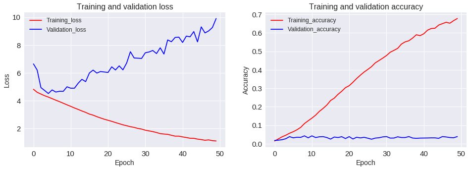
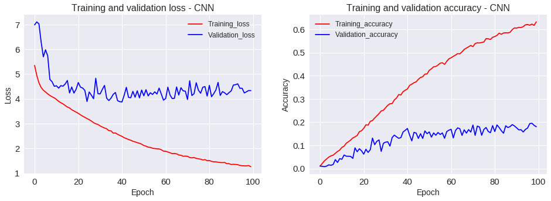
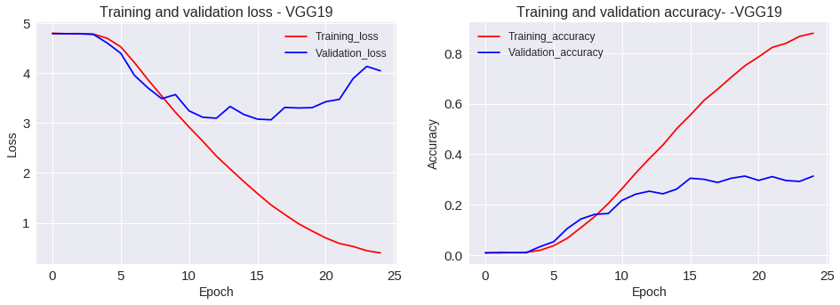

## Contents
{:.no_toc}
*  
{: toc}

**Model Descriptions**

We used various models to for each problem formuation (3-class universal classification, 3-class subject-specific classification, 7-class universal classification, 7-class subject-specific classification, general regression, subject-specific regression). The train set consists of data from subjects 1 to 5, and the test set consists of data from subject 6. We also used two cross validation methods, normal cross validation and leave-one-subject-out cross validations. 

More information related to model training and performance can be found on the Conlusions and Results page.


## 0. Data Preparation
### 1) Reading and Cleaning Data


```python
# Load the files 
total_files = io.loadmat('file_list.mat')['file_list']
total_targets = io.loadmat('file_list.mat')['labels']


# Functionto get the paths for images
def path_to_image(img_path):
    img = image.load_img('images/'+str(img_path), target_size=(size, size))
    x = image.img_to_array(img)
    return np.expand_dims(x, axis=0)

# function to convert images to numpy arrays
def get_images(img_paths):
    list_of_images = [path_to_image(img_path[0][0]) for img_path in (img_paths)] 
    return np.vstack(list_of_images)
    

# Get all the images into numpy array and normalize
total_tensors = get_images(total_files).astype('float32')/255

# convert target label to one-hot encoding
total_targets=np.float64(total_targets)-1
total_targets = keras.utils.to_categorical(total_targets, 120)


#Split data to Train and test
X_train, X_test, y_train, y_test = train_test_split(total_tensors,
                                                    total_targets, random_state=9999,
                                                    test_size=0.2, stratify=total_targets)
```
```python
# Save the test and train data to use it later
np.save('gdrive/My Drive/Colab Notebooks/X_train', X_train)
np.save('gdrive/My Drive/Colab Notebooks/X_test', X_test)
np.save('gdrive/My Drive/Colab Notebooks/y_train', y_train)
np.save('gdrive/My Drive/Colab Notebooks/y_test', y_test)
```

## 1. Baseline Neural netwrok model

   ```python
  #Load the data

xtrain=np.load('gdrive/My Drive/Colab Notebooks/X_train.npy')
xtest=np.load('gdrive/My Drive/Colab Notebooks/X_test.npy')
ytrain=np.load('gdrive/My Drive/Colab Notebooks/y_train.npy')
ytest=np.load('gdrive/My Drive/Colab Notebooks/y_test.npy')
```
```python
# Flatten input array

X_train = xtrain.reshape(xtrain.shape[0],-1)
X_test = xtest.reshape(xtest.shape[0],-1)
```
```python
#  Run the model for 50 epochs

epochs = 50
num_hidden1 =100
num_hidden2 =100
num_hidden3 =100
num_hidden4 =100
num_hidden5 =100
num_hidden6 =100
num_hidden7 =100
num_hidden8 =100
num_hidden9 =100
num_hidden10 =100
drop_out=0.0

inputsize=X_train.shape[1]


model = Sequential()

model.add(Dense(num_hidden1, input_dim=inputsize))
model.add(BatchNormalization())
model.add(Activation('relu'))
model.add(Dropout(drop_out))

model.add(Dense(num_hidden2))
model.add(BatchNormalization())
model.add(Activation('relu'))
model.add(Dropout(drop_out))

model.add(Dense(num_hidden3))
model.add(BatchNormalization())
model.add(Activation('relu'))
model.add(Dropout(drop_out))

model.add(Dense(num_hidden4))
model.add(BatchNormalization())
model.add(Activation('relu'))
model.add(Dropout(drop_out))

model.add(Dense(num_hidden5))
model.add(BatchNormalization())
model.add(Activation('relu'))
model.add(Dropout(drop_out))

model.add(Dense(num_hidden6))
model.add(BatchNormalization())
model.add(Activation('relu'))
model.add(Dropout(drop_out))

model.add(Dense(num_hidden7))
model.add(BatchNormalization())
model.add(Activation('relu'))
model.add(Dropout(drop_out))

model.add(Dense(num_hidden8))
model.add(BatchNormalization())
model.add(Activation('relu'))
model.add(Dropout(drop_out))

model.add(Dense(num_hidden9))
model.add(BatchNormalization())
model.add(Activation('relu'))
model.add(Dropout(drop_out))

model.add(Dense(num_hidden10))
model.add(BatchNormalization())
model.add(Activation('relu'))
model.add(Dropout(drop_out))

model.add(Dense(120, activation = 'softmax')) 

model.compile(loss='categorical_crossentropy',optimizer='RMSprop', metrics=['accuracy'])

weight_path='gdrive/My Drive/Colab Notebooks/DNN_bound.hdf5'
checkpoint = ModelCheckpoint(weight_path, monitor='val_acc', verbose=1, save_best_only=True)
callbacks_list = [checkpoint]

model_history = model.fit(X_train, ytrain, epochs=epochs, batch_size=128, validation_split=0.2,callbacks=callbacks_list)
```


 
                                Fig1. Loss and accuracy of Baseline model

```python
scores = model.evaluate(X_test.reshape(X_test.shape[0],-1), ytest, verbose=0)
print(" The Test accuracy for baseline model is {:2f} %".format(scores[1]*100))
```
```python
The Test accuracy for baseline model is is 3.644 %
```

## 1. Convolutional Neural Network model

```python

kernerlsize=(3,3)
drop_out=0.5

#create model
model = Sequential()

# Convolution layer 1
model.add(Convolution2D(filters = 32, kernel_size = kernerlsize,padding = 'Same', 
                         activation ='relu',
                        input_shape = (96, 96, 3))) 
model.add(BatchNormalization())
model.add(MaxPooling2D(pool_size=(2,2)))
model.add(Dropout(drop_out))


# Convolution layer 2
model.add(Convolution2D (filters = 64, kernel_size = kernerlsize,padding = 'Same', 
                         activation ='relu')) 
model.add(BatchNormalization())
model.add(MaxPooling2D(pool_size=(2,2)))
model.add(Dropout(drop_out))


# Convolution layer 3
model.add(Convolution2D (filters = 128, kernel_size = kernerlsize,padding = 'Same', 
                         activation ='relu')) 
model.add(BatchNormalization())
model.add(MaxPooling2D(pool_size=(2,2)))
model.add(Dropout(drop_out))

# Convolution layer 4
model.add(Convolution2D (filters = 256, kernel_size = kernerlsize,padding = 'Same', 
                         activation ='relu')) 
model.add(BatchNormalization())
model.add(MaxPooling2D(pool_size=(2,2)))
model.add(Dropout(drop_out))


# Convolution layer 5
model.add(Convolution2D (filters = 512, kernel_size = kernerlsize,padding = 'Same', 
                         activation ='relu')) 
model.add(BatchNormalization())
model.add(MaxPooling2D(pool_size=(2,2)))
model.add(Dropout(drop_out))


# Convolution layer 6
model.add(Convolution2D (filters = 512, kernel_size = kernerlsize,padding = 'Same', 
                         activation ='relu')) 
model.add(BatchNormalization())
model.add(MaxPooling2D(pool_size=(2,2)))
model.add(Dropout(drop_out))


# Flatten
model.add(Flatten()) 

# Fully connected layer 
model.add(Dense(units = 1000)) 
model.add(BatchNormalization())
model.add(Activation('relu')) 
model.add(Dropout(drop_out))

#Output layer with 120 nodes
model.add(Dense(120, activation = 'softmax')) 
# Compile model

model.compile(loss='categorical_crossentropy',optimizer='adam', metrics=['accuracy'])

## save the weights, when validation is best

weight_path='gdrive/My Drive/Colab Notebooks/CNN_bound.hdf5'
checkpoint = ModelCheckpoint(weight_path, monitor='val_acc', verbose=1, save_best_only=True)
callbacks_list = [checkpoint]


print(model.summary())
model_history = model.fit(xtrain, ytrain, epochs=100, batch_size=128,validation_split=0.2, callbacks=callbacks_list)
```
##### Model summary
```python
_________________________________________________________________
Layer (type)                 Output Shape              Param #   
=================================================================
conv2d_25 (Conv2D)           (None, 96, 96, 32)        896       
_________________________________________________________________
batch_normalization_29 (Batc (None, 96, 96, 32)        128       
_________________________________________________________________
max_pooling2d_25 (MaxPooling (None, 48, 48, 32)        0         
_________________________________________________________________
dropout_23 (Dropout)         (None, 48, 48, 32)        0         
_________________________________________________________________
conv2d_26 (Conv2D)           (None, 48, 48, 64)        18496     
_________________________________________________________________
batch_normalization_30 (Batc (None, 48, 48, 64)        256       
_________________________________________________________________
max_pooling2d_26 (MaxPooling (None, 24, 24, 64)        0         
_________________________________________________________________
dropout_24 (Dropout)         (None, 24, 24, 64)        0         
_________________________________________________________________
conv2d_27 (Conv2D)           (None, 24, 24, 128)       73856     
_________________________________________________________________
batch_normalization_31 (Batc (None, 24, 24, 128)       512       
_________________________________________________________________
max_pooling2d_27 (MaxPooling (None, 12, 12, 128)       0         
_________________________________________________________________
dropout_25 (Dropout)         (None, 12, 12, 128)       0         
_________________________________________________________________
conv2d_28 (Conv2D)           (None, 12, 12, 256)       295168    
_________________________________________________________________
batch_normalization_32 (Batc (None, 12, 12, 256)       1024      
_________________________________________________________________
max_pooling2d_28 (MaxPooling (None, 6, 6, 256)         0         
_________________________________________________________________
dropout_26 (Dropout)         (None, 6, 6, 256)         0         
_________________________________________________________________
conv2d_29 (Conv2D)           (None, 6, 6, 512)         1180160   
_________________________________________________________________
batch_normalization_33 (Batc (None, 6, 6, 512)         2048      
_________________________________________________________________
max_pooling2d_29 (MaxPooling (None, 3, 3, 512)         0         
_________________________________________________________________
dropout_27 (Dropout)         (None, 3, 3, 512)         0         
_________________________________________________________________
conv2d_30 (Conv2D)           (None, 3, 3, 512)         2359808   
_________________________________________________________________
batch_normalization_34 (Batc (None, 3, 3, 512)         2048      
_________________________________________________________________
max_pooling2d_30 (MaxPooling (None, 1, 1, 512)         0         
_________________________________________________________________
dropout_28 (Dropout)         (None, 1, 1, 512)         0         
_________________________________________________________________
flatten_5 (Flatten)          (None, 512)               0         
_________________________________________________________________
dense_9 (Dense)              (None, 1000)              513000    
_________________________________________________________________
batch_normalization_35 (Batc (None, 1000)              4000      
_________________________________________________________________
activation_5 (Activation)    (None, 1000)              0         
_________________________________________________________________
dropout_29 (Dropout)         (None, 1000)              0         
_________________________________________________________________
dense_10 (Dense)             (None, 120)               120120    
=================================================================
Total params: 4,571,520
Trainable params: 4,566,512
Non-trainable params: 5,008
```
 
              Fig2. Loss and accuracy of CNN model
```python
scores = model.evaluate(xtest, ytest, verbose=0)
print(" The Test accuracy for CNN model is {:2f}".format(scores[1]*100))
```
```python
The Test accuracy for CNN model is 18.658 %
```
## VGG19

```python

#create model

model = models.Sequential()
conv_base =VGG19(weights='imagenet',
                include_top=False,input_shape=(96,96,3))
model.add(conv_base)

print(model)
model.add(layers.Flatten())
model.add(layers.Dense(1000, activation='relu'))
model.add(Dropout(0.2))
model.add(layers.Dense(500, activation='relu'))
model.add(Dropout(0.2))
model.add(layers.Dense(120, activation='softmax'))

conv_base.trainable=True
set_trainable=False
for layer in conv_base.layers:
  if layer.name == 'block4_conv1':
    set_trainable =True
  if set_trainable:
    layer.trainable =True
  else:
    layer.trainable =False
    
model.compile(loss='categorical_crossentropy',optimizer=optimizers.RMSprop(lr=5e-5), metrics=['accuracy'])

weight_path='gdrive/My Drive/Colab Notebooks/VGG19.hdf5'
checkpoint = ModelCheckpoint(weight_path, monitor='val_acc', verbose=1, save_best_only=True)
callbacks_list = [checkpoint]

print(model.summary())
model_history = model.fit(xtrain, ytrain, epochs=25, batch_size=64,validation_split=0.2,callbacks=callbacks_list)
```
#### Model summary
```python
_________________________________________________________________
Layer (type)                 Output Shape              Param #   
=================================================================
vgg19 (Model)                (None, 3, 3, 512)         20024384  
_________________________________________________________________
flatten_2 (Flatten)          (None, 4608)              0         
_________________________________________________________________
dense_4 (Dense)              (None, 1000)              4609000   
_________________________________________________________________
dropout_3 (Dropout)          (None, 1000)              0         
_________________________________________________________________
dense_5 (Dense)              (None, 500)               500500    
_________________________________________________________________
dropout_4 (Dropout)          (None, 500)               0         
_________________________________________________________________
dense_6 (Dense)              (None, 120)               60120     
=================================================================
Total params: 25,194,004
Trainable params: 22,868,436
Non-trainable params: 2,325,568
_________________________________________________________________
```
 
Fig3. Loss and accuracy of VGG19 model
```python
scores = model.evaluate(xtest, ytest, verbose=0)
print(" The Test accuracy for VGG19 model is {:2f}".format(scores[1]*100))
```
```python
The Test accuracy for VGG19 model is 30.1506 %
```
## VGG19 with image augmentation

```python
# split train data to train and validation sets
X_train, x_val, y_train, y_val = train_test_split(xtrain,
                                                    ytrain, test_size=0.2,random_state=9999,
                                                   stratify=ytrain)
# Imagedata generator wuth multiple 
image_generation = ImageDataGenerator(
                        featurewise_center=False,
                        featurewise_std_normalization=False,
                        rotation_range=10,
                        width_shift_range=0.1,
                        height_shift_range=0.1,
                        zoom_range=.1,
                        horizontal_flip=True)


#Fit the image generator to training data
image_generation.fit(X_train, augment=True)
```
```python

#create model

model = models.Sequential()
conv_base =VGG19(weights='imagenet',
                include_top=False,input_shape=(96,96,3))
model.add(conv_base)
model.add(layers.Flatten())
model.add(layers.Dense(1000, activation='relu'))
model.add(Dropout(0.2))
model.add(layers.Dense(500, activation='relu'))
model.add(Dropout(0.2))
model.add(layers.Dense(120, activation='softmax'))

conv_base.trainable=True
set_trainable=False
for layer in conv_base.layers:
  if layer.name == 'block4_conv1':
    set_trainable =True
  if set_trainable:
    layer.trainable =True
  else:
    layer.trainable =False
    
model.compile(loss='categorical_crossentropy',optimizer=optimizers.RMSprop(lr=5e-5), metrics=['accuracy'])

weight_path='gdrive/My Drive/Colab Notebooks/VGG19_aug.hdf5'
checkpoint = ModelCheckpoint(weight_path, monitor='val_acc', verbose=1, save_best_only=True)
callbacks_list = [checkpoint]

print(model.summary())
model_history = model.fit_generator(image_generation.flow(X_train, y_train, batch_size=64),
          epochs=50,
          verbose=1,
          steps_per_epoch=X_train.shape[0]//64,
          validation_data=(x_val,y_val),
          callbacks=callbacks_list)
```
#### Model summary
```python
_________________________________________________________________
Layer (type)                 Output Shape              Param #   
=================================================================
vgg19 (Model)                (None, 3, 3, 512)         20024384  
_________________________________________________________________
flatten_1 (Flatten)          (None, 4608)              0         
_________________________________________________________________
dense_1 (Dense)              (None, 1000)              4609000   
_________________________________________________________________
dropout_1 (Dropout)          (None, 1000)              0         
_________________________________________________________________
dense_2 (Dense)              (None, 500)               500500    
_________________________________________________________________
dropout_2 (Dropout)          (None, 500)               0         
_________________________________________________________________
dense_3 (Dense)              (None, 120)               60120     
=================================================================
Total params: 25,194,004
Trainable params: 22,868,436
Non-trainable params: 2,325,568
_________________________________________________________________
```
