## Contents
{:.no_toc}
*  
{: toc}

**Model Descriptions**

We used various models to for each problem formuation (3-class universal classification, 3-class subject-specific classification, 7-class universal classification, 7-class subject-specific classification, general regression, subject-specific regression). The train set consists of data from subjects 1 to 5, and the test set consists of data from subject 6. We also used two cross validation methods, normal cross validation and leave-one-subject-out cross validations. 

More information related to model training and performance can be found on the Conlusions and Results page.


## 0. Data Preparation
### 1) Reading and Cleaning Data


```python
### READING DATA

df = pd.read_csv('dataAll_csv8_withmm.csv')
df["slope_class"] = 0
df["slope_class"][df['ref_slope'] < 0] = -1
df["slope_class"][df['ref_slope'] == 0]= 0
df["slope_class"][df['ref_slope'] > 0]= 1
df = df.drop("ref_speed", axis=1)


subject_test = 6;

df_train = df[df['subject_number'] != subject_test]
df_test = df[df['subject_number'] ==subject_test]


X_train = df_train.iloc[:, :-2]
y_train = df_train.iloc[:, -1]
y_train_multi = df_train.iloc[:, -2]

X_test = df_test.iloc[:, :-2]
y_test = df_test.iloc[:, -1]
y_test_multi = df_test.iloc[:, -2]


### Remove unnecessary predictors (Time, Angle Z, Accerelation X and Y)

for i in range(df_train.shape[1]):
    if df_train.columns[i] == 'timeGaitExt_L_0':
        break
        
index_unused_features = i


a = 52
X_train = df_train[df_train.columns[a:a+107]].copy()
X_test = df_test[df_test.columns[a:a+107]].copy()
a += 107

while a < index_unused_features:
    
    # IMU data except angle Z, acc X, acc Y 

    if not ((df_train.columns[a].split('_')[0] == 'angleZ') or (df_train.columns[a].split('_')[0] == 'accXRot') or (df_train.columns[a].split('_')[0] == 'accYRot')):
        X_train = pd.concat([X_train, df_train[df_train.columns[a:a+107]]], axis =1)
        X_test = pd.concat([X_test, df_test[df_test.columns[a:a+107]]], axis =1)

    a += 107
    
X_train = pd.concat([X_train, df_train[df_train.columns[-4:-2]]], axis =1)
X_test = pd.concat([X_test, df_test[df_test.columns[-4:-2]]], axis =1)

subnum_train = df_train[df_train.columns[0]].values
subnum_test = df_test[df_test.columns[0]].values

print("Number of predictors we have: %d" %X_train.shape[1])
```


    Number of predictors we have: 1928


```python
def standardize(x, x_ref):
    mean = np.mean(x_ref);
    std = np.std(x_ref);  

    x_stand = (x - mean)/std;
    return x_stand

X_train_unstand = X_train.copy();
X_train_std = standardize(X_train, X_train_unstand)

X_test_unstand = X_test.copy();
X_test_std = standardize(X_test, X_train_unstand)
```


### 2) Custom Functions


```python
def custom_cv(est_list, X, y, paramlist, subject_nums):    
    # iterate through each parameter with estimators premade
    # subject_list is the same order of df entries
    param_score_list = [];
    for e in est_list:
        
        # iterate through each fold
        fold_score_list = [0]*5;
        subject_list = list(set(subject_nums))
        
        for j, sub_num in enumerate(subject_list):
            valid = subject_nums == sub_num
            train = subject_nums == sub_num
            Xtrain = X[train];
            ytrain = y[train];
            Xvalid = X[valid];
            yvalid = y[valid];
            
            # fit and validate
            e.fit(Xtrain, ytrain)
            fold_score_list[j] = e.score(Xvalid, yvalid)
        
        param_score_list.append(np.mean(fold_score_list))
                    
    i_best = np.argmax(param_score_list)
    
    # fit again on all train data
    best_est = est_list[i_best]
    best_est.fit(X, y)
    
    return paramlist[i_best], param_score_list[i_best], best_est
```


```python
def subject_set(X, y, subject_num):
    X_list = []
    y_list = []
    
    subject_list = list(set(subject_num))
    
    for j, subject in enumerate(subject_list):

        subject_TF = subject_num == subject

        X_list.append(X[subject_TF]);
        y_list.append(y[subject_TF]);

        
    # split into test and train
    
    X_train_list = [None]*len(subject_list);
    X_test_list = [None]*len(subject_list);

    y_train_list = [None]*len(subject_list);
    y_test_list = [None]*len(subject_list);

    for j in range(0, len(X_list)):
        np.random.seed(9001)
        msk = np.random.rand(len(X_list[j])) < 0.75
        X_train_list[j] = X_list[j][msk]
        X_test_list[j] = X_list[j][~msk]

        y_train_list[j] = y_list[j][msk]
        y_test_list[j] = y_list[j][~msk]
    
    
    return X_train_list, y_train_list, X_test_list, y_test_list
```


```python
def regression_to_classification(y_true, y_pred):

    y_class = np.zeros(len(y_pred))
    
    for i, prediction in enumerate(y_pred):
        if prediction < -7.5:
            y_class[i] = -10
        elif prediction >= -7.5 and prediction < -2.5:
            y_class[i] = -5
        elif prediction >= -2.5 and prediction < 2.5:
            y_class[i] = 0
        elif prediction >= 2.5 and prediction < 7.5:
            y_class[i] = 5
        elif prediction >= 7.5 and prediction < 12.5:
            y_class[i] = 10
        elif prediction >= 12.5 and prediction < 17.5:
            y_class[i] = 15            
        elif prediction >= 17.5:
            y_class[i] = 20            
        
    y_tf = y_class == y_true
    accuracy = np.sum(y_tf) / len(y_true)  
    
    return y_class, accuracy
```


```python
def plot_confusion_matrix(cm, classes,
                          normalize=False,
                          title='Confusion matrix',
                          cmap=plt.cm.Blues):

    if normalize:
        cm = cm.astype('float') / cm.sum(axis=1)[:, np.newaxis]
        print("Normalized confusion matrix")
    else:
        print('Confusion matrix')

    print(cm)

    plt.imshow(cm, interpolation='nearest', cmap=cmap)
    plt.title(title)
    plt.colorbar()
    tick_marks = np.arange(len(classes))
    plt.xticks(tick_marks, classes, rotation=45)
    plt.yticks(tick_marks, classes)

    fmt = '.2f' if normalize else 'd'
    thresh = cm.max() / 2.
    for i, j in itertools.product(range(cm.shape[0]), range(cm.shape[1])):
        plt.text(j, i, format(cm[i, j], fmt),
                 horizontalalignment="center",
                 color="white" if cm[i, j] > thresh else "black")

    plt.tight_layout()
    plt.ylabel('True label')
    plt.xlabel('Predicted label')
```


## 1. Classification into 3 Classes (Uphill / Flat / Downhill)

### 1) Baseline Model: Decision Tree (Default: Unlimited Depth)


```python
dt_base = DecisionTreeClassifier(max_depth = None)
dt_base.fit(X_train, y_train)

score_base_train = dt_base.score(X_train, y_train)
score_base_test  = dt_base.score(X_test, y_test)

print('Score on train set is %f' %score_base_train)
print('Score on test set is %f' %score_base_test)
print('Total Number of Predictors is %d' %np.sum(dt_base.feature_importances_ > 0))
```


    Score on train set is 1.000000
    Score on test set is 0.817284
    Total Number of Predictors is 78


```python
plt.plot(np.arange(len(y_test)), dt_base.predict(X_test), 's', alpha = 0.5, label = 'Prediction')
plt.plot(np.arange(len(y_test)), y_test, 'r-', label = 'True')

plt.yticks( np.unique(y_test), ('Downhill', 'Flat', 'Uphill') )

plt.xlabel("Test Data")
plt.legend()
plt.title("Baseline Model")

```


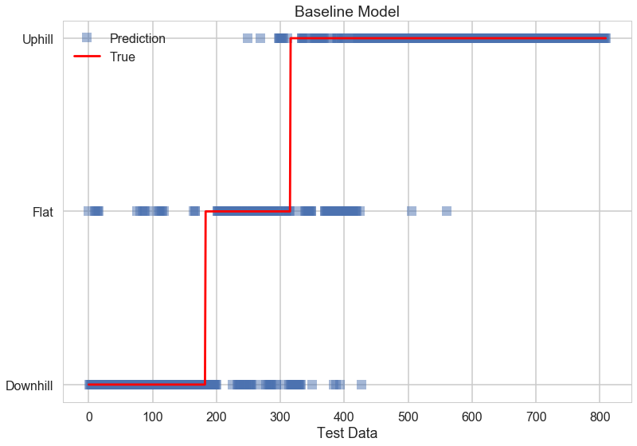


### 2) Decision Tree (Leave One Subject Out CV)


```python
paramlist = np.array([2, 4, 8]);
est_list = [];

for p in paramlist:

    dt = DecisionTreeClassifier(max_depth= p)
    est_list.append(dt)
    
best_p, best_score, best_est_dt = custom_cv(est_list, X_train, y_train, paramlist, subnum_train)

print('Best parameter is %f' %best_p)
score_dtcv_train = best_est_dt.score(X_train, y_train)
print('Score on train set is %f' %score_dtcv_train)

score_dtcv_test = best_est_dt.score(X_test, y_test)
print('Score on test set is %f' %score_dtcv_test)

ind_order_dt_cv = np.argsort(best_est_dt.feature_importances_)[::-1]
print(‘Significant predictors are: \n’)

for j in range(10):
    print(X_test.columns[ind_order_dt_cv[j]])

print('\nTotal Number of Predictors is %d' %np.sum(best_est_dt.feature_importances_> 0))

```


    Best parameter is 8.000000
    Score on train set is 0.985939
    Score on test set is 0.838272

    Significant predictors are: 

    angleX_L_42
    angleY_A_52mm
    gyroX_R_64mm
    angleX_R_48
    angleX_L_62
    gyroZ_L_min_mm
    angleX_L_max
    angleX_R_52
    angleY_R_54
    accZRot_A_88
    
    Total Number of Predictors is 56


### 3) Decision Tree (Normal CV)


```python
dt = tree.DecisionTreeClassifier ()
tree_depths = {'max_depth': paramlist}
dtGrid  = GridSearchCV(dt, tree_depths, cv = 5)
dtGrid.fit(X_train, y_train)

print(dtGrid.best_params_, 'best score is %f' %dtGrid.best_score_)

dt_cv = tree.DecisionTreeClassifier(max_depth=dtGrid.best_params_['max_depth'])
dt_cv.fit(X_train, y_train)

score_dt_cv_train = dt_cv.score(X_train, y_train)
print('Score on train set for Decision Tree classifier is %f' %score_dt_cv_train)
score_dt_cv_test = dt_cv.score(X_test, y_test)
print('Score on test set for Decision Tree classifier is %f' %score_dt_cv_test)

ind_order_dt_cv_normal = np.argsort(dt_cv.feature_importances_)[::-1]
print(‘Significant predictors are: \n’)

for j in range(10):
    print(X_test.columns[ind_order_dt_cv_normal[j]])

print('\nTotal Number of Predictors is %d' %np.sum(dt_cv.feature_importances_> 0))
```


    {'max_depth': 8} best score is 0.745710
    Score on train set for Decision Tree classifier is 0.985939
    Score on test set for Decision Tree classifier is 0.832099

    Significant predictors are:

    angleX_L_42
    angleY_A_52mm
    gyroX_R_64mm
    angleX_R_48
    angleX_L_62
    gyroZ_L_min_mm
    angleX_L_max
    angleX_R_52
    angleY_R_54
    accZRot_A_88
    
    Total Number of Predictors is 55


### 4) Decision Tree (PCA Components: 90% explained variance)


```python

ncomp = 2;
pca = PCA(n_components=ncomp)
pca.fit(X_train)
X_train_pca = pca.transform(X_train)

for j in range(0, X_train.shape[0]):
    if y_train.values[j] == 1:
        plt.scatter(X_train_pca[j,0], X_train_pca[j, 1], color='red', alpha = 0.2)
    elif y_train.values[j] == -1:
        plt.scatter(X_train_pca[j,0], X_train_pca[j, 1], color='green', alpha = 0.2)
    else:
        plt.scatter(X_train_pca[j,0], X_train_pca[j, 1], color='black', alpha = 0.2)

plt.xlabel('Principal Component 1')
plt.ylabel('Principal Component 2')
```


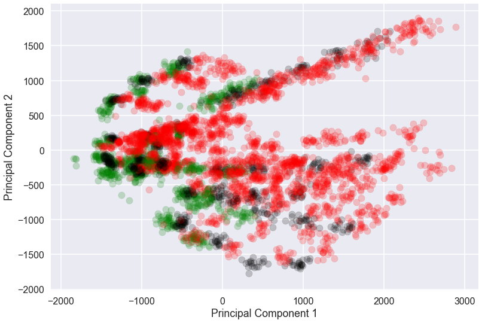


```python

### PCA Components that explain 90% of variance


n = 200
pca = PCA(n_components=n)
pca.fit(X_train_std)

for i in range(n):
    if np.sum(pca.explained_variance_ratio_[:i]) > 0.90:
        break

ncomp = i

pca = PCA(n_components=ncomp)
pca.fit(X_train_std)
X_train_pca = pca.transform(X_train_std)
X_test_pca = pca.transform(X_test_std)

print("Number of PCA components: %d" %ncomp)

dt_pca = tree.DecisionTreeClassifier(max_depth = 6)
dt_pca.fit(X_train_pca, y_train)

print('Score on train set for Decision Tree classifier(PCA) is %f' %dt_pca.score(X_train_pca, y_train))
print('Score on test set for Decision Tree classifier(PCA) is %f' %dt_pca.score(X_test_pca, y_test))
```


    Number of PCA components: 61

    Score on train set for Decision Tree classifier(PCA) is 0.921354
    Score on test set for Decision Tree classifier(PCA) is 0.782716


### 5) Random Forest (Leave One Subject Out CV)


```python
n_list = [8, 16, 32, 64];
est_list = [];
for n in n_list:
    rf = RandomForestClassifier(oob_score = True, n_estimators=n, max_features=int(np.sqrt(len(X_train.columns))) , n_jobs=-1)
    est_list.append(rf)
    

best_p, best_score, best_est_rf = custom_cv(est_list, X_train, y_train, n_list, subnum_train)

print('Best parameter is: %d' %best_p)

print('Score on train set is %f' %best_est_rf.score(X_train, y_train))

print('Score on test set is %f' %best_est_rf.score(X_test, y_test))

```


    Best parameter is: 32
    Score on train set is 1.000000
    Score on test set is 0.904938


```python
plt.plot(np.arange(len(y_test)), best_est_rf.predict(X_test), 's', alpha = 0.5, label = 'Prediction')
plt.plot(np.arange(len(y_test)), y_test, 'r-', label = 'True')

plt.yticks( np.unique(y_test), ('Downhill', 'Flat', 'Uphill') )

plt.xlabel("Test Data")
plt.legend()
plt.title("Best Model: Random Forest")


```


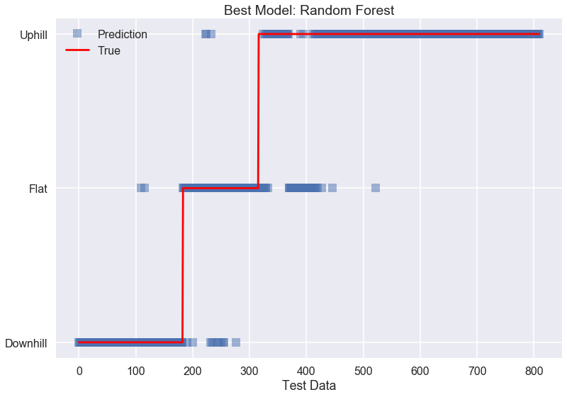


```python
class_names = ['Downhill', 'Flat', 'Uphill']

cnf_matrix = confusion_matrix(y_test, best_est_rf.predict(X_test))
np.set_printoptions(precision=2)

plt.figure()
plot_confusion_matrix(cnf_matrix, classes=class_names,
                      title='Confusion matrix: Best Model')


```


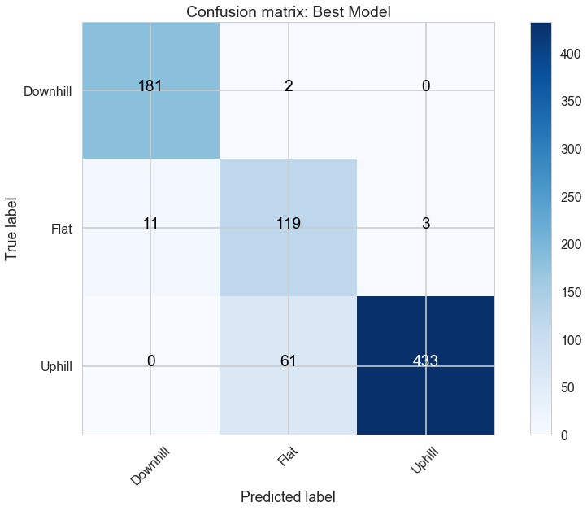


### 6) Adaboost (Leave One Subject Out CV)


```python
tree_depths = [2, 4, 6, 8, 10]; # tree_depths
n_est = [4, 8, 12, 20, 30, 50]
lam = [0.05, 0.1, 0.2, 0.5]
est_list = [];
paramlist = list(itertools.product(tree_depths, n_est, lam))

for td in tree_depths:
    for n in n_est:
        for learn_rate in lam:
            adaboost = AdaBoostClassifier(tree.DecisionTreeClassifier(max_depth=td), n_estimators= n, learning_rate = learn_rate)
            est_list.append(adaboost)

best_p, best_score, best_est_treeboost = custom_cv(est_list, X_train, y_train, paramlist, subnum_train)

print('Best parameter is', best_p)

print('Score on train set is %f' %best_est_treeboost.score(X_train, y_train))
print('Score on test set is %f' %best_est_treeboost.score(X_test, y_test))
```


    Best parameter is (4, 4, 0.1)
    Score on train set is 0.974023
    Score on test set is 0.876543


### 7) Logistic Regression (Leave One Subject Out CV)


```python
cs = [0.00001, 0.0001, 0.001, 0.01];

est_list = [];

for c in cs:
    clf = LogisticRegression(C=c)
    est_list.append(clf)
    

best_p, best_score, best_clf_cv = custom_cv(est_list, X_train, y_train, cs, subnum_train)

print('Best parameter is')
print(best_p)
score_clf_train = best_clf_cv.score(X_train, y_train)
print('Score on train set is %f' %score_clf_train)

score_clf_test = best_clf_cv.score(X_test, y_test)
print('Score on test set is %f' %score_clf_test)

print("number of predictors:", np.sum(best_clf_cv.coef_[0] != 0))

```

    Best parameter is
    0.0001
    Score on train set is 0.999285
    Score on test set is 0.835802

    number of predictors: 1928


### 8) SVM (Leave One Subject Out CV)


```python
## only use significant features
X_train_ld = X_train.iloc[:, ind_order_dt_cv[:20]] #low dimensional
X_test_ld = X_test.iloc[:, ind_order_dt_cv[:20]]

Cs = [ 0.1, 1, 10]
gammas = [0.1, 1, 2]

paramlist = list(itertools.product(Cs, gammas))

est_list = [];

for c in Cs:
    for g in gammas:
        svc = svm.SVC(C=c, kernel = 'rbf', gamma = g)
        est_list.append(svc)
    
best_p, best_score, best_svc_cv = custom_cv(est_list, X_train_ld, y_train, paramlist, subnum_train)

print('Best parameter is')
print(best_p)
score_svc_train = best_svc_cv.score(X_train_ld, y_train)
print('Score on train set is %f' %score_svc_train)

score_svc_test = best_svc_cv.score(X_test_ld, y_test)
print('Score on test set is %f' %score_svc_test)

```


    Best parameter is
    (1, 0.1)
    Score on train set is 1.000000
    Score on test set is 0.609877


### 9) GMM


```python
from sklearn.mixture import GMM

i= 5

X_train_gmm = X_train.iloc[:, ind_order_dt_cv[:i]] #low dimensional
X_test_gmm = X_test.iloc[:, ind_order_dt_cv[:i]]


n_classes = len(np.unique(y_train))

gmm= GMM(n_components= 3, covariance_type='full', init_params='wc', n_iter=20)
gmm.fit(X_train_gmm)
gmm_prediction = gmm.predict(X_test_gmm)

np.sum(gmm_prediction == y_test)/len(y_test+1)
```

    0.22345679012345679


```python
plt.plot(np.arange(len(y_test)), gmm.predict(X_test_gmm), 's', alpha = 0.5, label = 'Prediction')
plt.plot(np.arange(len(y_test)), y_test+1, 'r-', label = 'True')

plt.legend()
np.sum(gmm_prediction == y_test)/len(y_test+1)

plt.xlabel("Test Data")
plt.yticks( np.unique(y_test)+1, ('Downhill', 'Flat', 'Uphill') )

plt.title("GMM")

```


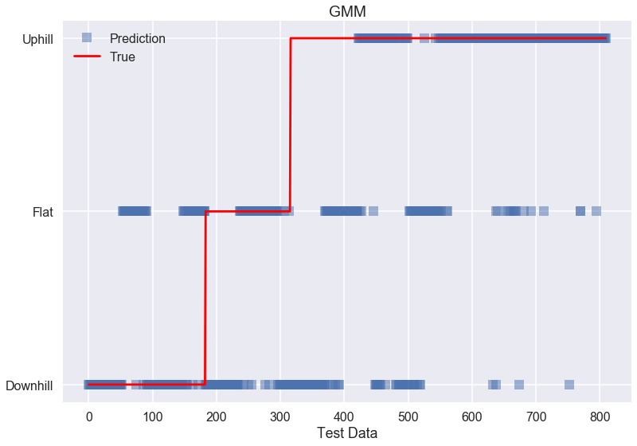


### 10) Individually trained model: Random Forest


```python
X_train_list, y_train_list, X_test_list, y_test_list= subject_set(X_train, y_train, subnum_train)

n_list = [2,8, 16, 32, 64]
rf_cv_ind_list = [None] * len(X_train_list)
score_rf_cv_train_list = [None] * len(X_train_list)
score_rf_cv_test_list = [None] * len(X_train_list)

for i in range(len(X_train_list)):

    rf_ind = RandomForestClassifier(oob_score = True, max_features=int(np.sqrt(len(X_train_list[i].columns))) , n_jobs=-1)
    n_est = {'n_estimators': n_list}
    rfGrid_ind  = GridSearchCV(rf_ind, n_est, cv = 5)
    rfGrid_ind.fit(X_train_list[i], y_train_list[i])


    rf_cv_ind = RandomForestClassifier(oob_score = True, n_estimators= rfGrid_ind.best_params_['n_estimators'], 
                                       max_features=int(np.sqrt(len(X_train_list[i].columns))) , n_jobs=-1)
    rf_cv_ind.fit(X_train_list[i], y_train_list[i])
    
    rf_cv_ind_list[i] = rf_cv_ind


    score_rf_cv_train_list[i] = rf_cv_ind.score(X_train_list[i], y_train_list[i])
    score_rf_cv_test_list[i] = rf_cv_ind.score(X_test_list[i], y_test_list[i])

print('Average score on train set is %.3f'  %np.average(score_rf_cv_train_list))
print('Average score on test set is %.3f' %np.average(score_rf_cv_test_list))

print("number of predictor:", X_train_list[0].shape[1])

```


    Average score on train set is 1.000
    Average score on test set is 0.999
    number of predictor: 1928


```python
i= 1
start_time = time.time()
rf_cv_ind_list[i].predict(X_test_list[i])
print("--- %s seconds ---" % (time.time() - start_time))
```


    --- 0.11072587966918945 seconds ---


```python
fig, axes = plt.subplots(2,3, figsize=(20,10))
axes = axes.flatten()

for i in range(len(X_train_list)):
    axes[i].plot(rf_cv_ind_list[i].predict(X_test_list[i]), '.', color= colors[i].get_rgb(), alpha = 0.5, label = 'Prediction')
    axes[i].plot(y_test_list[i].values, 'r-', alpha = 0.7, label = 'True')
    axes[i].set_title('Subject '+str(i+1))
    axes[i].legend()
    axes[i].set_yticks( np.unique(y_test))
    axes[i].set_yticklabels(['Down', 'Flat', 'Uphill'])


axes[3].set_xlabel("Test Data")
axes[4].set_xlabel("Test Data")
axes[5].set_xlabel("Test Data")

axes[5].set_yticks( np.unique(y_test))
axes[5].set_yticklabels(['Down', 'Flat', 'Uphill'])


plt.show()
```


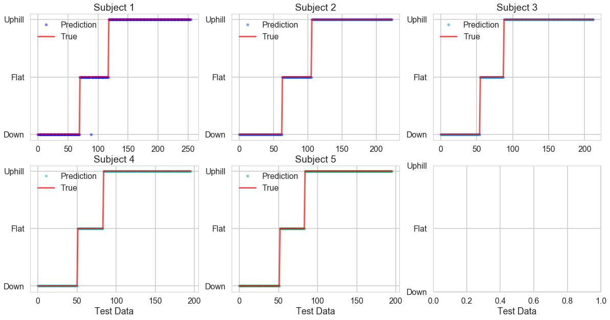


## 2. Classification into 7 classes (-10, -5, 0, 5, 10, 15, 20)

### 1) Baseline Model: Decision Tree (Default: Unlimited Depth)


```python
base_dt_m = DecisionTreeClassifier()
base_dt_m.fit(X_train, y_train_multi)

print('Score on train set is %f' %base_dt_m.score(X_train, y_train_multi))
print('Score on test set is %f' %base_dt_m.score(X_test, y_test_multi))

print('* R2 Score (regression metric) %f' %r2_score(y_test_multi, base_dt_m.predict(X_test)))

print("Number of predictors: %d" %np.sum(base_dt_m.feature_importances_> 0))
```


    Score on train set is 1.000000
    Score on test set is 0.472840
    * R2 Score (regression metric) 0.722818

    Number of predictors: 258


```python
start_time = time.time()
base_dt_m.predict(X_test.iloc[0,:])
print("--- %s seconds ---" % (time.time() - start_time))
```


    --- 0.004525184631347656 seconds ---


```python
plt.plot(np.arange(len(y_test)), base_dt_m.predict(X_test), 's', alpha = 0.2, label = 'Prediction')
plt.plot(np.arange(len(y_test)), y_test_multi, 'r-', label = 'True')

plt.xlabel("Test Data")
plt.ylabel("Slope (%)")
plt.legend()
plt.title("Baseline Model")
```


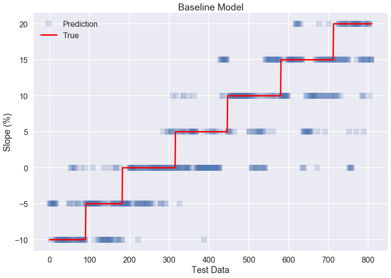


### 2) Decision Tree (Leave One Subject Out CV)


```python
paramlist = np.array([2, 4, 6, 8, 10, 12]);
est_list = [];

for p in paramlist:
    dt = DecisionTreeClassifier(max_depth= p)
    est_list.append(dt)
    

best_p, best_score, best_est_dt_m = custom_cv(est_list, X_train, y_train_multi, paramlist, subnum_train)

print('Best parameter is %f' %best_p)
print('Score on train set is %f' %best_est_dt_m.score(X_train, y_train_multi))
print('Score on test set is %f' %best_est_dt_m.score(X_test, y_test_multi))
print('* R2 Score (regression metric) %f' %r2_score(y_test_multi, best_est_dt_m.predict(X_test)))

print('Total Number of Predictors is %d' %np.sum(best_est_dt_m.feature_importances_ > 0))
```


    Best parameter is 8.000000
    Score on train set is 0.919924
    Score on test set is 0.495062
    * R2 Score (regression metric) 0.751662

    Total Number of Predictors is 129


### 3) Decision Tree (Normal CV)


```python
paramlist = np.array([4, 6, 8, 10, 12]);

dt = tree.DecisionTreeClassifier ()
tree_depths = {'max_depth': paramlist}
dtGrid_m  = GridSearchCV(dt, tree_depths, cv = 5)
dtGrid_m.fit(X_train, y_train_multi)

print(dtGrid_m.best_params_, 'best score is %f' %dtGrid_m.best_score_)

dt_cv_m = tree.DecisionTreeClassifier(max_depth= dtGrid_m.best_params_['max_depth'])
dt_cv_m.fit(X_train, y_train_multi)

score_dt_cv_train_m = dt_cv_m.score(X_train, y_train_multi)
print('Score on train set for Decision Tree classifier is %f' %score_dt_cv_train_m)
score_dt_cv_test_m = dt_cv_m.score(X_test, y_test_multi)
print('Score on test set for Decision Tree classifier is %f' %score_dt_cv_test_m)

r2_score_dt_cv_m = r2_score(y_test_multi, dt_cv_m.predict(X_test))
print('* R2 Score (regression metric) %f' %r2_score_dt_cv_m)

print('Total Number of Predictors is %d' %np.sum(dt_cv_m.feature_importances_ > 0))

```


    {'max_depth': 10} best score is 0.395615

    Score on train set for Decision Tree classifier is 0.968065
    Score on test set for Decision Tree classifier is 0.487654
    * R2 Score (regression metric) 0.748145

    Total Number of Predictors is 199


### 4) Decision Tree (PCA Components: 90% explained variance)


```python

n = 200
pca = PCA(n_components=n)
pca.fit(X_train_std)
for i in range(n):
    if np.sum(pca.explained_variance_ratio_[:i]) > 0.90:
        break

ncomp = i


pca = PCA(n_components=ncomp)
pca.fit(X_train_std)
X_train_pca = pca.transform(X_train_std)
X_test_pca = pca.transform(X_test_std)

print("number of predictors: %d" %ncomp)


paramlist = np.array([6, 8, 10, 12]);
est_list = [];

for p in paramlist:
    dt_pca = DecisionTreeClassifier(max_depth= p)
    est_list.append(dt_pca)
    

best_p, best_score, best_est_dt_pca_m = custom_cv(est_list, X_train_pca, y_train_multi, paramlist, subnum_train)


print('Best parameter is %f' %best_p)

print('Score on train set is %f' %best_est_dt_pca_m.score(X_train_pca, y_train_multi))

print('Score on test set is %f' %best_est_dt_pca_m.score(X_test_pca, y_test_multi))

r2_score_dt_pca_m = r2_score(y_test_multi, best_est_dt_pca_m.predict(X_test_pca))
print('* R2 Score (regression metric) %f' %r2_score_dt_pca_m)

```


    number of predictors: 61

    Best parameter is 12.000000
    Score on train set is 0.969018
    Score on test set is 0.367901
    * R2 Score (regression metric) 0.646136


### 5) Random Forest (Leave One Subject Out CV)


```python
n_list = [2,8, 16, 32, 64, 128];
est_list = [];
for n in n_list:
    rf = RandomForestClassifier(oob_score = True, n_estimators=n, max_features=int(np.sqrt(len(X_train.columns))) , n_jobs=-1)
    est_list.append(rf)
    

best_p, best_score, best_est_rf_m = custom_cv(est_list, X_train, y_train_multi, n_list, subnum_train)


print('Best parameter is: %d' %best_p)

print('Score on train set is %f' %best_est_rf_m.score(X_train, y_train_multi))

print('Score on test set is %f' %best_est_rf_m.score(X_test, y_test_multi))

print('* R2 Score (regression metric) %f' %r2_score(y_test_multi, best_est_rf_m.predict(X_test)))
```


    Best parameter is: 16
    Score on train set is 1.000000
    Score on test set is 0.481481
    * R2 Score (regression metric) 0.774174


```python
start_time = time.time()
best_est_rf_m.predict(X_test.iloc[0,:])
print("--- %s seconds ---" % (time.time() - start_time))
```


    --- 0.10733389854431152 seconds ---


```python
plt.plot(np.arange(len(y_test)), best_est_rf_m.predict(X_test), 's', alpha = 0.2, label = 'Prediction')
plt.plot(np.arange(len(y_test)), y_test_multi, 'r-', label = 'True')

plt.xlabel("Test Data")
plt.ylabel("Slope (%)")
plt.legend()
plt.title("Best Model: Random Forest")
```


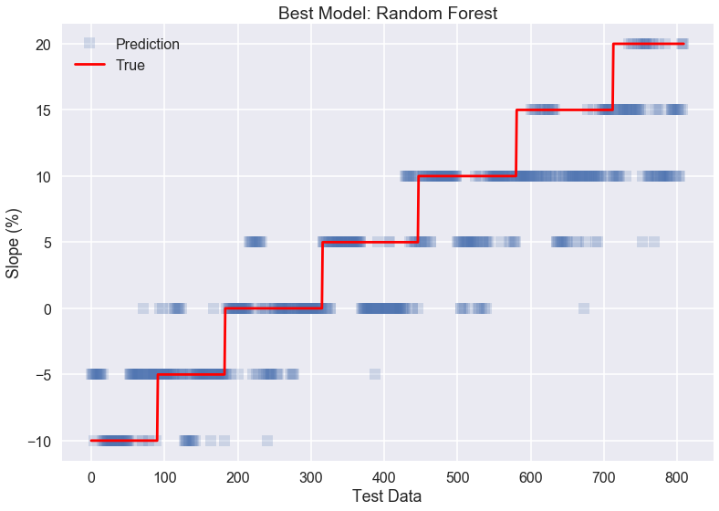


```python
class_names = ['-10%', '-5%', '0%', '5%', '10%', '15%', '20%']

cnf_matrix_mt = confusion_matrix(y_test_multi, best_est_rf_m.predict(X_test))
np.set_printoptions(precision=2)

plt.figure()
plot_confusion_matrix(cnf_matrix_mt, classes=class_names,
                      title='Confusion matrix: Best Model')

```


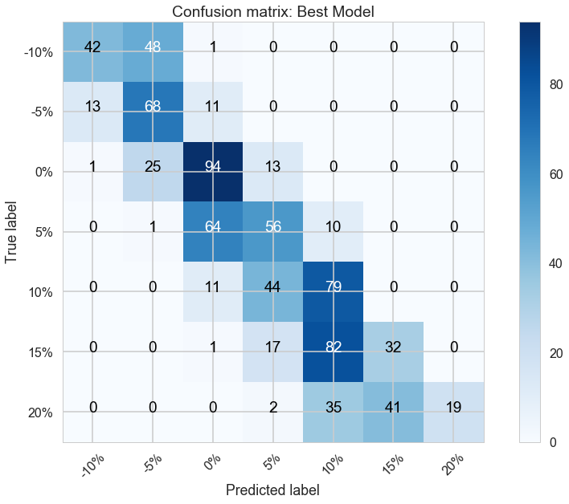


### 6) Adaboost(Leave One Subject Out CV)


```python
tree_depths = [ 6, 8, 10, 12]; # tree_depths
n_est = [6, 10, 15, 20]
lam = [0.05, 0.1, 0.2, 0.5]
est_list = [];
paramlist = list(itertools.product(tree_depths, n_est, lam))

for td in tree_depths:
    for n in n_est:
        for learn_rate in lam:
            adaboost = AdaBoostClassifier(tree.DecisionTreeClassifier(max_depth=td), n_estimators= n, learning_rate = learn_rate)
            est_list.append(adaboost)

best_p, best_score, best_est_treeboost_m = custom_cv(est_list, X_train, y_train_multi, paramlist, subnum_train)

print('Best parameter is:', best_p)

print('Score on train set is %f' %best_est_treeboost_m.score(X_train, y_train_multi))

print('Score on test set is %f' %best_est_treeboost_m.score(X_test, y_test_multi))

print('* R2 Score (regression metric) %f' %r2_score(y_test_multi, best_est_treeboost_m.predict(X_test)))
```


    Best parameter is: (6, 6, 0.1)
    Score on train set is 0.946616
    Score on test set is 0.490123
    * R2 Score (regression metric) 0.769601


```python
start_time = time.time()
best_est_treeboost_m.predict(X_test.iloc[0,:])
print("--- %s seconds ---" % (time.time() - start_time))
```


    --- 0.0042531490325927734 seconds ---


### 7) Logistic Regression (Leave One Subject Out CV)


```python
Cs = np.array([0.0001, 0.01, 10, 1000])

est_list = [];
for c in Cs:
    clf = LogisticRegression(C = c, multi_class='ovr');
    est_list.append(clf)

best_p, best_score, best_est_log_m = custom_cv(est_list, X_train_std, y_train_multi, Cs, subnum_train)

print('Score on train set for Decision Tree classifier is %.3f' %best_est_log_m.score(X_train_std, y_train_multi))

print('Score on test set for Decision Tree classifier is %.3f' %best_est_log_m.score(X_test_std, y_test_multi))

print('* R2 Score (regression metric) %f' %r2_score(y_test_multi, best_est_log_m.predict(X_test_std)))

print("number of predictors: %d" %np.sum(best_est_log_m.coef_[0] >0))
```


    Score on train set for Decision Tree classifier is 1.000
    Score on test set for Decision Tree classifier is 0.406
    * R2 Score (regression metric) 0.508600
    number of predictors: 953


### 8) Individually trained model: Random Forest


```python
X_train_list_n, y_train_multi_list_n, X_test_list_n, y_test_multi_list_n= subject_set(X_train, y_train_multi, subnum_train)

n_list = [2,8, 16, 32, 64]
rf_cv_ind_list_n = [None] * len(X_train_list_n)
score_rf_cv_train_list_n = [None] * len(X_train_list_n)
score_rf_cv_test_list_n = [None] * len(X_train_list_n)

for i in range(len(X_train_list_n)):

    rf_ind_n = RandomForestClassifier(oob_score = True, max_features=int(np.sqrt(len(X_train_list_n[i].columns))) , n_jobs=-1)
    n_est = {'n_estimators': n_list}
    rfGrid_ind_n  = GridSearchCV(rf_ind_n, n_est, cv = 5)
    rfGrid_ind_n.fit(X_train_list_n[i], y_train_multi_list_n[i])


    rf_cv_ind_n = RandomForestClassifier(oob_score = True, n_estimators= rfGrid_ind_n.best_params_['n_estimators'], 
                                       max_features=int(np.sqrt(len(X_train_list_n[i].columns))) , n_jobs=-1)
    rf_cv_ind_n.fit(X_train_list_n[i], y_train_multi_list_n[i])
    
    rf_cv_ind_list_n[i] = rf_cv_ind_n


    score_rf_cv_train_list_n[i] = rf_cv_ind_n.score(X_train_list_n[i], y_train_multi_list_n[i])
    score_rf_cv_test_list_n[i] = rf_cv_ind_n.score(X_test_list_n[i], y_test_multi_list_n[i])

print('Average score on train set is %.3f'  %np.average(score_rf_cv_train_list_n))
print('Average score on test set is %.3f' %np.average(score_rf_cv_test_list_n))

print("number of predictor:", X_train_list_n[0].shape[1])

r2_score_rf_ind_list_n = [None]*5
for i in np.arange(len(X_train_list_n)):
    r2_score_rf_ind_list_n[i] = r2_score(y_test_multi_list_n[i], rf_cv_ind_list_n[i].predict(X_test_list_n[i]))

print('* R2 Score (regression metric) %f' %np.average(r2_score_rf_ind_list_n))
```


    Average score on train set is 1.000
    Average score on test set is 0.992
    number of predictor: 1928

    * R2 Score (regression metric) 0.997017


```python
i= 1
start_time = time.time()
rf_cv_ind_list_n[i].predict(X_test_list_n[i])
print("--- %s seconds ---" % (time.time() - start_time))
```


    --- 0.1100001335144043 seconds ---


```python
fig, axes = plt.subplots(2,3, figsize=(20,10))
axes = axes.flatten()

for i in range(len(X_train_list_n)):
    axes[i].plot(rf_cv_ind_list_n[i].predict(X_test_list_n[i]), '.', color= colors[i].get_rgb(), alpha = 0.5, label = 'Prediction')
    axes[i].plot(y_test_multi_list_n[i].values, 'r-', alpha = 0.7, label = 'True')
    axes[i].set_title('Subject '+str(i+1))
    axes[i].legend()


axes[3].set_xlabel("Test Data")
axes[4].set_xlabel("Test Data")
axes[5].set_xlabel("Test Data")

axes[0].set_ylabel("Slope (%)")
axes[3].set_ylabel("Slope (%)")


```


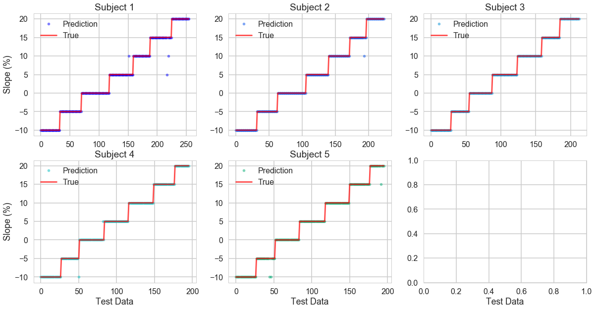


## 3. Regression
### 1) Baseline Model: Linear Regression


```python
linear = LinearRegression()
linear.fit(X_train, y_train_multi)


print('Score on train set is %.3f' %linear.score(X_train, y_train_multi))

print('Score on test set is %.3f' %linear.score(X_test, y_test_multi))

print("Classfication converted accuracy on Test set: %0.3f" %regression_to_classification(y_test_multi, linear.predict(X_test))[1])
```


    Score on train set is 0.991
    Score on test set is 0.917
    Classfication converted accuracy on Test set: 0.727


```python
plt.plot(np.arange(len(y_test)), linear.predict(X_test), 's', alpha = 0.3, label = 'Prediction')
plt.plot(np.arange(len(y_test)), y_test_multi, 'r-', label = 'True')

plt.xlabel("Test Data")
plt.ylabel("Slope (%)")
plt.legend()
plt.title("Baseline Model")
```


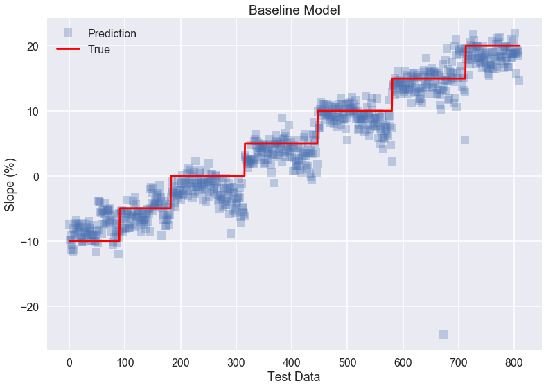


### 2) Lasso (Leave One Subject Out CV)


```python
paramlist = np.array([0.0001, 0.001, 0.01, 0.1, 1, 10, 100])

est_list = [];
for p in paramlist:
    lasso = Lasso(alpha= p)
    est_list.append(lasso)

best_p, best_score, best_est_lasso = custom_cv(est_list, X_train_std, y_train_multi, paramlist, subnum_train)
best_p

print("Best parameter:",best_p)

print('CV score is %.3f' %best_score)
score_lasso_cv_train = best_est_lasso.score(X_train_std, y_train_multi)
print('Score on train set is %.3f' %score_lasso_cv_train)

score_lasso_cv_test = best_est_lasso.score(X_test_std, y_test_multi)
print('Score on test set is %.3f' %score_lasso_cv_test)

print("number of predictor:", np.sum(best_est_lasso.coef_ != 0))
print("Classfication converted accuracy on Test set: %0.3f" %regression_to_classification(y_test_multi, best_est_lasso.predict(X_test_std))[1])

```


    Best parameter: 0.0001
    CV score is 1.000
    Score on train set is 0.987
    Score on test set is 0.947

    number of predictor: 1799
    Classfication converted accuracy on Test set: 0.779


### 3) Ridge (Leave One Subject Out CV)


```python
paramlist = np.array([ 0.0001, 0.001, 0.01, 0.1, 1, 10, 100])

est_list = [];
for p in paramlist:
    ridge = Ridge(alpha= p)
    est_list.append(ridge)

best_p, best_score, best_est_ridge = custom_cv(est_list, X_train_std, y_train_multi, paramlist, subnum_train)


print("Best parameter:",best_p)

print('CV score is %.3f' %best_score)
score_ridge_cv_train = best_est_ridge.score(X_train_std, y_train_multi)
print('Score on train set is %.3f' %score_ridge_cv_train)

score_ridge_cv_test = best_est_ridge.score(X_test_std, y_test_multi)
print('Score on test set is %.3f' %score_ridge_cv_test)

print("number of predictor:", np.sum(best_est_ridge.coef_ != 0))
print("Classfication converted accuracy on Test set: %0.3f" %regression_to_classification(y_test_multi, best_est_ridge.predict(X_test_std))[1])

```


    Best parameter: 0.0001
    CV score is 1.000
    Score on train set is 0.987
    Score on test set is 0.946

    number of predictor: 1928
    Classfication converted accuracy on Test set: 0.772


### 4) Linear Regression (PCA Components: 90% explained variance)


```python

n = 200
pca = PCA(n_components=n)
pca.fit(X_train_std)
for i in range(n):
    if np.sum(pca.explained_variance_ratio_[:i]) > 0.90:
        break

ncomp = i
ncomp

pca = PCA(n_components=ncomp)
pca.fit(X_train_std)
X_train_pca = pca.transform(X_train_std)
X_test_pca = pca.transform(X_test_std)


linear_pca = LinearRegression()
linear_pca.fit(X_train_pca, y_train_multi)


print('Score on train set is %.3f' %linear_pca.score(X_train_pca, y_train_multi))
print('Score on test set is %.3f' %linear_pca.score(X_test_pca, y_test_multi))
print("Classfication converted accuracy on Test set: %0.3f" %regression_to_classification(y_test_multi, linear_pca.predict(X_test_pca))[1])

print("number of predictor:", ncomp)

```


    Score on train set is 0.950
    Score on test set is 0.947
    Classfication converted accuracy on Test set: 0.754

    number of predictor: 61


```python
start_time = time.time()

linear_pca.predict(X_test_pca[0,:])
print("--- %s seconds ---" % (time.time() - start_time))
```


    --- 0.0004489421844482422 seconds ---


```python
plt.plot(np.arange(len(y_test)), linear_pca.predict(X_test_pca), 's', alpha = 0.3, label = 'Prediction')
plt.plot(np.arange(len(y_test)), y_test_multi, 'r-', label = 'True')

plt.xlabel("Test Data")
plt.ylabel("Slope (%)")
plt.legend()
plt.title("Best Model: Linear Regression with PCA Components")
```


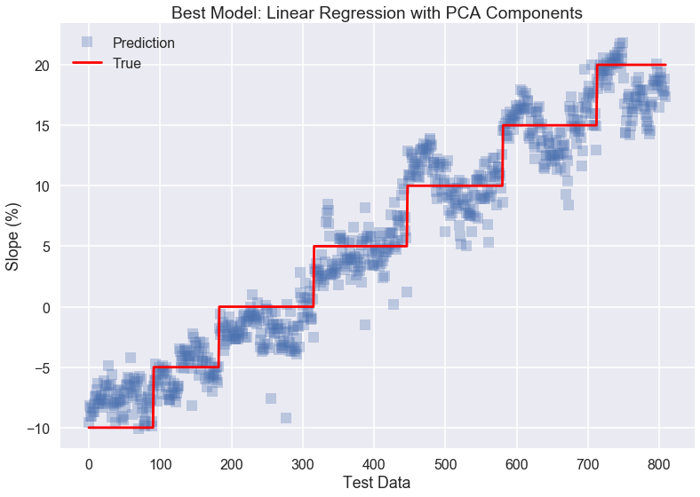


### 5) Lasso (2nd order predictors of PCA Components: 90% explained variance)


```python
### Higher Order Polynomial

poly_2 = PolynomialFeatures(degree = 2, include_bias = False)
X_train_pca_poly_2 = poly_2.fit_transform(X_train_pca)
X_test_pca_poly_2 = poly_2.fit_transform(X_test_pca)


lambdas = [.001,.01, 0.1, 1, 10, 100, 1000]

lasso_pca_poly_2 = LassoCV(cv=5, alphas=lambdas, fit_intercept=True, normalize=False)
lasso_pca_poly_2.fit(X_train_pca_poly_2, y_train_multi)

print('Score on train set is %.3f'  %lasso_pca_poly_2.score(X_train_pca_poly_2, y_train_multi))
print('Score on test set is %.3f' %lasso_pca_poly_2.score(X_test_pca_poly_2, y_test_multi))
print("Classfication converted accuracy on Test set: %0.3f" %regression_to_classification(y_test_multi, lasso_pca_poly_2.predict(X_test_pca_poly_2))[1])
      
print("number of predictor:", np.sum(lasso_pca_poly_2.coef_ != 0))
```


    Score on train set is 0.996
    Score on test set is 0.937
    Classfication converted accuracy on Test set: 0.743
    number of predictor: 1608


### 6) Individually trained model: Linear Regression (PCA Components: 90% explained variance)


```python
X_train_list_m, y_train_multi_list_m, X_test_list_m, y_test_multi_list_m= subject_set(X_train_pca, y_train_multi, subnum_train)


linear_pca_ind_list = [None] * len(X_train_list_m)
score_linear_pca_train_list = [None] * len(X_train_list_m)
score_linear_pca_test_list = [None] * len(X_train_list_m)

for i in range(len(X_train_list_m)):

    linear_pca_ind = LinearRegression()
    linear_pca_ind.fit(X_train_list_m[i], y_train_multi_list_m[i])

    linear_pca_ind_list[i] = linear_pca_ind
    
    score_linear_pca_train_list[i] = linear_pca_ind.score(X_train_list_m[i], y_train_multi_list_m[i])
    score_linear_pca_test_list[i]  = linear_pca_ind.score(X_test_list_m[i], y_test_multi_list_m[i])


print('Average score on train set is %.3f'  %np.average(score_linear_pca_train_list))
print('Average score on test set is %.3f' %np.average(score_linear_pca_test_list))

print("number of predictor:", X_train_list_m[0].shape[1])
```


    Average score on train set is 0.983
    Average score on test set is 0.978
    number of predictor: 61


```python
fig, axes = plt.subplots(2,3, figsize=(20,10))
axes = axes.flatten()

for i in range(len(X_train_list_m)):
    axes[i].plot(linear_pca_ind_list[i].predict(X_test_list_m[i]), '.', color= colors[i].get_rgb(), alpha = 0.5, label = 'Prediction')
    axes[i].plot(y_test_multi_list_m[i].values, 'r-', alpha = 0.7, label = 'True')
    axes[i].set_title('Subject '+str(i+1))
    axes[i].legend()


axes[3].set_xlabel("Test Data")
axes[4].set_xlabel("Test Data")
axes[5].set_xlabel("Test Data")

axes[0].set_ylabel("Slope (%)")
axes[3].set_ylabel("Slope (%)")


plt.show()
```


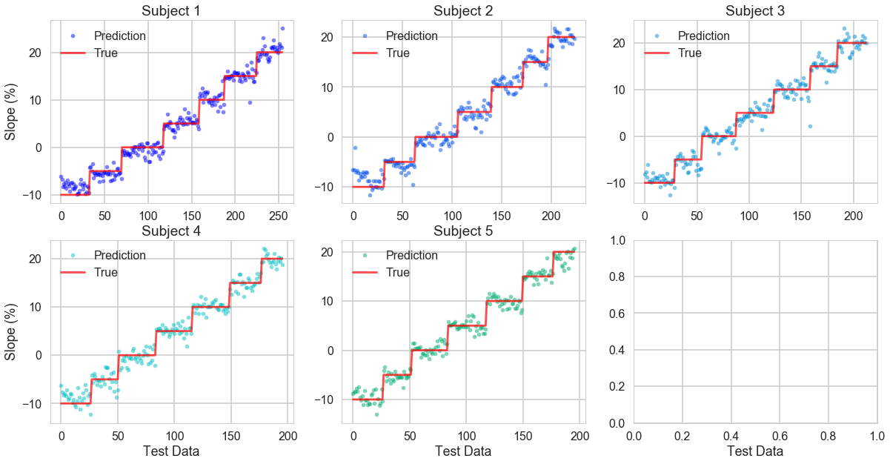

