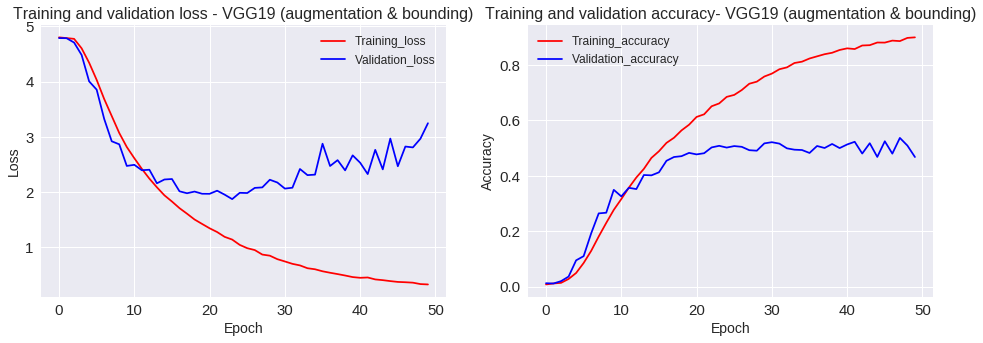

{:.no_toc}
*  
{: toc}
**Model Descriptions**

We have worked on various models for image classification. We have created a baseline model with multiple layers of Neural network, convolutional neural networks models, pre-trained models such as VGG19 and also tried to enhance the test accuracy using image augmentation and cropping images using the abounding boxes. All the models were discussed below and the challenge was the less number of images that we have for each class, and also the computational resources that are available. The total number of classes that are in dataset are 120, and number of images that are available for modelling are 20580. Furthermore, we have split training set to training and validation sets for cross-validation. All the results and conclusions are discussed in Conclusions and Results page.


##  Data Preparation

The dataset provided "file_list.mat" file, from where you can extract the image names and labels, using that file images are converted to numpy arrays and same with the labels. After converting them in to numpy arrays, we have saved them so that they can be used in different models.

```python
# Load the files 
total_files = io.loadmat('file_list.mat')['file_list']
total_targets = io.loadmat('file_list.mat')['labels']


# Functionto get the paths for images
def path_to_image(img_path):
    img = image.load_img('images/'+str(img_path), target_size=(size, size))
    x = image.img_to_array(img)
    return np.expand_dims(x, axis=0)

# function to convert images to numpy arrays
def get_images(img_paths):
    list_of_images = [path_to_image(img_path[0][0]) for img_path in (img_paths)] 
    return np.vstack(list_of_images)
    

# Get all the images into numpy array and normalize
total_tensors = get_images(total_files).astype('float32')/255

# convert target label to one-hot encoding
total_targets=np.float64(total_targets)-1
total_targets = keras.utils.to_categorical(total_targets, 120)


#Split data to Train and test
X_train, X_test, y_train, y_test = train_test_split(total_tensors,
                                                    total_targets, random_state=9999,
                                                    test_size=0.2, stratify=total_targets)
```
```python
# Save the test and train data to use it later
np.save('gdrive/My Drive/Colab Notebooks/X_train', X_train)
np.save('gdrive/My Drive/Colab Notebooks/X_test', X_test)
np.save('gdrive/My Drive/Colab Notebooks/y_train', y_train)
np.save('gdrive/My Drive/Colab Notebooks/y_test', y_test)
```

## Deep Learning Models

Before deep diving in to more advanced models, we created a baseline model with 10 hidden layers and each layer has 100 nodes. Inorder to overcome the over fitting, batch normalization and drop out is used. The baseline model is run for 50 epochs and we have created a callback which would save only best weights based on cross validation accuracy.


#### 1. Baseline Neural network model

   ```python
  #Load the data

xtrain=np.load('gdrive/My Drive/Colab Notebooks/X_train.npy')
xtest=np.load('gdrive/My Drive/Colab Notebooks/X_test.npy')
ytrain=np.load('gdrive/My Drive/Colab Notebooks/y_train.npy')
ytest=np.load('gdrive/My Drive/Colab Notebooks/y_test.npy')
   ```
```python
# Flatten input array

X_train = xtrain.reshape(xtrain.shape[0],-1)
X_test = xtest.reshape(xtest.shape[0],-1)
```
```python
#  Run the model for 50 epochs

epochs = 50
num_hidden1 =100
num_hidden2 =100
num_hidden3 =100
num_hidden4 =100
num_hidden5 =100
num_hidden6 =100
num_hidden7 =100
num_hidden8 =100
num_hidden9 =100
num_hidden10 =100
drop_out=0.0

inputsize=X_train.shape[1]


model = Sequential()

model.add(Dense(num_hidden1, input_dim=inputsize))
model.add(BatchNormalization())
model.add(Activation('relu'))
model.add(Dropout(drop_out))

model.add(Dense(num_hidden2))
model.add(BatchNormalization())
model.add(Activation('relu'))
model.add(Dropout(drop_out))

model.add(Dense(num_hidden3))
model.add(BatchNormalization())
model.add(Activation('relu'))
model.add(Dropout(drop_out))

model.add(Dense(num_hidden4))
model.add(BatchNormalization())
model.add(Activation('relu'))
model.add(Dropout(drop_out))

model.add(Dense(num_hidden5))
model.add(BatchNormalization())
model.add(Activation('relu'))
model.add(Dropout(drop_out))

model.add(Dense(num_hidden6))
model.add(BatchNormalization())
model.add(Activation('relu'))
model.add(Dropout(drop_out))

model.add(Dense(num_hidden7))
model.add(BatchNormalization())
model.add(Activation('relu'))
model.add(Dropout(drop_out))

model.add(Dense(num_hidden8))
model.add(BatchNormalization())
model.add(Activation('relu'))
model.add(Dropout(drop_out))

model.add(Dense(num_hidden9))
model.add(BatchNormalization())
model.add(Activation('relu'))
model.add(Dropout(drop_out))

model.add(Dense(num_hidden10))
model.add(BatchNormalization())
model.add(Activation('relu'))
model.add(Dropout(drop_out))

model.add(Dense(120, activation = 'softmax')) 

model.compile(loss='categorical_crossentropy',optimizer='RMSprop', metrics=['accuracy'])

weight_path='gdrive/My Drive/Colab Notebooks/DNN_bound.hdf5'
checkpoint = ModelCheckpoint(weight_path, monitor='val_acc', verbose=1, save_best_only=True)
callbacks_list = [checkpoint]

model_history = model.fit(X_train, ytrain, epochs=epochs, batch_size=128, validation_split=0.2,callbacks=callbacks_list)
```
##### Model summary
```python
_________________________________________________________________
Layer (type)                 Output Shape              Param #   
=================================================================
dense_12 (Dense)             (None, 100)               2764900   
_________________________________________________________________
batch_normalization_11 (Batc (None, 100)               400       
_________________________________________________________________
activation_11 (Activation)   (None, 100)               0         
_________________________________________________________________
dropout_11 (Dropout)         (None, 100)               0         
_________________________________________________________________
dense_13 (Dense)             (None, 100)               10100     
_________________________________________________________________
batch_normalization_12 (Batc (None, 100)               400       
_________________________________________________________________
activation_12 (Activation)   (None, 100)               0         
_________________________________________________________________
dropout_12 (Dropout)         (None, 100)               0         
_________________________________________________________________
dense_14 (Dense)             (None, 100)               10100     
_________________________________________________________________
batch_normalization_13 (Batc (None, 100)               400       
_________________________________________________________________
activation_13 (Activation)   (None, 100)               0         
_________________________________________________________________
dropout_13 (Dropout)         (None, 100)               0         
_________________________________________________________________
dense_15 (Dense)             (None, 100)               10100     
_________________________________________________________________
batch_normalization_14 (Batc (None, 100)               400       
_________________________________________________________________
activation_14 (Activation)   (None, 100)               0         
_________________________________________________________________
dropout_14 (Dropout)         (None, 100)               0         
_________________________________________________________________
dense_16 (Dense)             (None, 100)               10100     
_________________________________________________________________
batch_normalization_15 (Batc (None, 100)               400       
_________________________________________________________________
activation_15 (Activation)   (None, 100)               0         
_________________________________________________________________
dropout_15 (Dropout)         (None, 100)               0         
_________________________________________________________________
dense_17 (Dense)             (None, 100)               10100     
_________________________________________________________________
batch_normalization_16 (Batc (None, 100)               400       
_________________________________________________________________
activation_16 (Activation)   (None, 100)               0         
_________________________________________________________________
dropout_16 (Dropout)         (None, 100)               0         
_________________________________________________________________
dense_18 (Dense)             (None, 100)               10100     
_________________________________________________________________
batch_normalization_17 (Batc (None, 100)               400       
_________________________________________________________________
activation_17 (Activation)   (None, 100)               0         
_________________________________________________________________
dropout_17 (Dropout)         (None, 100)               0         
_________________________________________________________________
dense_19 (Dense)             (None, 100)               10100     
_________________________________________________________________
batch_normalization_18 (Batc (None, 100)               400       
_________________________________________________________________
activation_18 (Activation)   (None, 100)               0         
_________________________________________________________________
dropout_18 (Dropout)         (None, 100)               0         
_________________________________________________________________
dense_20 (Dense)             (None, 100)               10100     
_________________________________________________________________
batch_normalization_19 (Batc (None, 100)               400       
_________________________________________________________________
activation_19 (Activation)   (None, 100)               0         
_________________________________________________________________
dropout_19 (Dropout)         (None, 100)               0         
_________________________________________________________________
dense_21 (Dense)             (None, 100)               10100     
_________________________________________________________________
batch_normalization_20 (Batc (None, 100)               400       
_________________________________________________________________
activation_20 (Activation)   (None, 100)               0         
_________________________________________________________________
dropout_20 (Dropout)         (None, 100)               0         
_________________________________________________________________
dense_22 (Dense)             (None, 120)               12120     
=================================================================
Total params: 2,871,920
Trainable params: 2,869,920
Non-trainable params: 2,000
_________________________________________________________________
```

##### Loss and accuracy plot of Baseline model
 
​                               
##### Test accuracy
```python
scores = model.evaluate(X_test.reshape(X_test.shape[0],-1), ytest, verbose=0)
print(" The Test accuracy for baseline model is {:2f} %".format(scores[1]*100))
```
```python
The Test accuracy for baseline model is is 3.644 %
```

#### 2. Convolutional Neural Network model

The baseline model was able to achieve the test accuracy of 3.64 %, the next model that was considered is Convolutional Neural Networks. We CNN architecture which consists of 5 convents and one fully connected layer. The model was run for 100 epoch and the best weights are saved using cross-validation.

```python

#create model

drop_out=0.0
kernelsize=3

model = Sequential()

# Convolution layer 1
model.add(Convolution2D(filters = 32, kernel_size = kernelsize,padding = 'Same', 
                         activation ='relu',
                        input_shape = (96, 96, 3))) 
model.add(BatchNormalization())
model.add(MaxPooling2D(pool_size=(2,2)))
model.add(Dropout(drop_out))


# Convolution layer 2
model.add(Convolution2D (filters = 64, kernel_size = kernelsize,padding = 'Same', 
                         activation ='relu')) 
model.add(BatchNormalization())
model.add(MaxPooling2D(pool_size=(2,2)))
model.add(Dropout(drop_out))


# Convolution layer 3
model.add(Convolution2D (filters = 128, kernel_size = kernelsize,padding = 'Same', 
                         activation ='relu')) 
model.add(BatchNormalization())
model.add(MaxPooling2D(pool_size=(2,2)))
model.add(Dropout(drop_out))

# Convolution layer 4
model.add(Convolution2D (filters = 256, kernel_size = kernelsize,padding = 'Same', 
                         activation ='relu')) 
model.add(BatchNormalization())
model.add(MaxPooling2D(pool_size=(2,2)))
model.add(Dropout(drop_out))


# Convolution layer 5
model.add(Convolution2D (filters = 512, kernel_size = kernelsize,padding = 'Same', 
                         activation ='relu')) 
model.add(BatchNormalization())
model.add(MaxPooling2D(pool_size=(2,2)))
model.add(Dropout(drop_out))

model.add(GlobalAveragePooling2D())

# Fully connected layer 
model.add(Dense(units = 1000)) 
model.add(BatchNormalization())
model.add(Activation('relu')) 
model.add(Dropout(0.2))

#Output layer with 120 nodes
model.add(Dense(120, activation = 'softmax')) 
# Compile model

model.compile(loss='categorical_crossentropy',optimizer='adam', metrics=['accuracy'])

weight_path='gdrive/My Drive/Colab Notebooks/CNN_bound.hdf5'
checkpoint = ModelCheckpoint(weight_path, monitor='val_acc', verbose=1, save_best_only=True)
callbacks_list = [checkpoint]


print(model.summary())
model_history = model.fit(xtrain, ytrain, epochs=100, batch_size=128,validation_split=0.2, callbacks=callbacks_list))
```
##### Model summary
```python
_________________________________________________________________
Layer (type)                 Output Shape              Param #   
=================================================================
conv2d_22 (Conv2D)           (None, 96, 96, 32)        896       
_________________________________________________________________
batch_normalization_24 (Batc (None, 96, 96, 32)        128       
_________________________________________________________________
max_pooling2d_21 (MaxPooling (None, 48, 48, 32)        0         
_________________________________________________________________
dropout_23 (Dropout)         (None, 48, 48, 32)        0         
_________________________________________________________________
conv2d_23 (Conv2D)           (None, 48, 48, 64)        18496     
_________________________________________________________________
batch_normalization_25 (Batc (None, 48, 48, 64)        256       
_________________________________________________________________
max_pooling2d_22 (MaxPooling (None, 24, 24, 64)        0         
_________________________________________________________________
dropout_24 (Dropout)         (None, 24, 24, 64)        0         
_________________________________________________________________
conv2d_24 (Conv2D)           (None, 24, 24, 128)       73856     
_________________________________________________________________
batch_normalization_26 (Batc (None, 24, 24, 128)       512       
_________________________________________________________________
max_pooling2d_23 (MaxPooling (None, 12, 12, 128)       0         
_________________________________________________________________
dropout_25 (Dropout)         (None, 12, 12, 128)       0         
_________________________________________________________________
conv2d_25 (Conv2D)           (None, 12, 12, 256)       295168    
_________________________________________________________________
batch_normalization_27 (Batc (None, 12, 12, 256)       1024      
_________________________________________________________________
max_pooling2d_24 (MaxPooling (None, 6, 6, 256)         0         
_________________________________________________________________
dropout_26 (Dropout)         (None, 6, 6, 256)         0         
_________________________________________________________________
conv2d_26 (Conv2D)           (None, 6, 6, 512)         1180160   
_________________________________________________________________
batch_normalization_28 (Batc (None, 6, 6, 512)         2048      
_________________________________________________________________
max_pooling2d_25 (MaxPooling (None, 3, 3, 512)         0         
_________________________________________________________________
dropout_27 (Dropout)         (None, 3, 3, 512)         0         
_________________________________________________________________
global_average_pooling2d_4 ( (None, 512)               0         
_________________________________________________________________
dense_5 (Dense)              (None, 1000)              513000    
_________________________________________________________________
batch_normalization_29 (Batc (None, 1000)              4000      
_________________________________________________________________
activation_3 (Activation)    (None, 1000)              0         
_________________________________________________________________
dropout_28 (Dropout)         (None, 1000)              0         
_________________________________________________________________
dense_6 (Dense)              (None, 120)               120120    
=================================================================
Total params: 2,209,664
Trainable params: 2,205,680
Non-trainable params: 3,984
_________________________________________________________________
```
##### Loss and accuracy plot of CNN model
 

##### Test accuracy
```python
scores = model.evaluate(xtest, ytest, verbose=0)
print(" The Test accuracy for CNN model is {:2f}".format(scores[1]*100))
```
```python
The Test accuracy for CNN model is 18.658 %
```
#### 3. CNN with image augmentation

As we can see above, the best accuracy that we have got after fine-tuning the CNN is around 18.66% even after having batch normalization and drop out. Inorder to increase the accuracy, we did image augmentation, since we have less number of images per class. Using the image data generator that comes with keras, we are able to generate batches of image data with real-time data augmentation. The augmentation that was considered are rotation, width shift, height shift, zoom range, horizontal flip. Below are the images which have gone through multiple image augmentations.

```python
# split train data to train and validation sets
X_train, x_val, y_train, y_val = train_test_split(xtrain,
                                                    ytrain, test_size=0.2,random_state=9999,
                                                   stratify=ytrain)
# Imagedata generator wuth multiple 
image_generation = ImageDataGenerator(
                        featurewise_center=False,
                        featurewise_std_normalization=False,
                        rotation_range=10,
                        width_shift_range=0.1,
                        height_shift_range=0.1,
                        zoom_range=.1,
                        horizontal_flip=True)


#Fit the image generator to training data
image_generation.fit(X_train, augment=True)
```
```python
#create model

drop_out=0.0
kernelsize=3

model = Sequential()

# Convolution layer 1
model.add(Convolution2D(filters = 32, kernel_size = kernelsize,padding = 'Same', 
                         activation ='relu',
                        input_shape = (96, 96, 3))) 
model.add(BatchNormalization())
model.add(MaxPooling2D(pool_size=(2,2)))
model.add(Dropout(drop_out))


# Convolution layer 2
model.add(Convolution2D (filters = 64, kernel_size = kernelsize,padding = 'Same', 
                         activation ='relu')) 
model.add(BatchNormalization())
model.add(MaxPooling2D(pool_size=(2,2)))
model.add(Dropout(drop_out))


# Convolution layer 3
model.add(Convolution2D (filters = 128, kernel_size = kernelsize,padding = 'Same', 
                         activation ='relu')) 
model.add(BatchNormalization())
model.add(MaxPooling2D(pool_size=(2,2)))
model.add(Dropout(drop_out))

# Convolution layer 4
model.add(Convolution2D (filters = 256, kernel_size = kernelsize,padding = 'Same', 
                         activation ='relu')) 
model.add(BatchNormalization())
model.add(MaxPooling2D(pool_size=(2,2)))
model.add(Dropout(drop_out))


# Convolution layer 5
model.add(Convolution2D (filters = 512, kernel_size = kernelsize,padding = 'Same', 
                         activation ='relu')) 
model.add(BatchNormalization())
model.add(MaxPooling2D(pool_size=(2,2)))
model.add(Dropout(drop_out))

model.add(GlobalAveragePooling2D())

# Fully connected layer 
model.add(Dense(units = 1000)) 
model.add(BatchNormalization())
model.add(Activation('relu')) 
model.add(Dropout(0.2))

#Output layer with 120 nodes
model.add(Dense(120, activation = 'softmax')) 
# Compile model

model.compile(loss='categorical_crossentropy',optimizer=optimizers.RMSprop(lr=1e-3), metrics=['accuracy'])

weight_path='gdrive/My Drive/Colab Notebooks/CNN_aug.hdf5'
checkpoint = ModelCheckpoint(weight_path, monitor='val_acc', verbose=1, save_best_only=True)
callbacks_list = [checkpoint]


print(model.summary())
model_history = model.fit_generator(image_gen.flow(X_train, y_train, batch_size=64),
          epochs=30,
          verbose=1,
          steps_per_epoch=X_train.shape[0]//64,
          validation_data=(x_val,y_val),
          callbacks=callbacks_list)
```
##### Model summary
```python
_________________________________________________________________
Layer (type)                 Output Shape              Param #   
=================================================================
conv2d_22 (Conv2D)           (None, 96, 96, 32)        896       
_________________________________________________________________
batch_normalization_24 (Batc (None, 96, 96, 32)        128       
_________________________________________________________________
max_pooling2d_21 (MaxPooling (None, 48, 48, 32)        0         
_________________________________________________________________
dropout_23 (Dropout)         (None, 48, 48, 32)        0         
_________________________________________________________________
conv2d_23 (Conv2D)           (None, 48, 48, 64)        18496     
_________________________________________________________________
batch_normalization_25 (Batc (None, 48, 48, 64)        256       
_________________________________________________________________
max_pooling2d_22 (MaxPooling (None, 24, 24, 64)        0         
_________________________________________________________________
dropout_24 (Dropout)         (None, 24, 24, 64)        0         
_________________________________________________________________
conv2d_24 (Conv2D)           (None, 24, 24, 128)       73856     
_________________________________________________________________
batch_normalization_26 (Batc (None, 24, 24, 128)       512       
_________________________________________________________________
max_pooling2d_23 (MaxPooling (None, 12, 12, 128)       0         
_________________________________________________________________
dropout_25 (Dropout)         (None, 12, 12, 128)       0         
_________________________________________________________________
conv2d_25 (Conv2D)           (None, 12, 12, 256)       295168    
_________________________________________________________________
batch_normalization_27 (Batc (None, 12, 12, 256)       1024      
_________________________________________________________________
max_pooling2d_24 (MaxPooling (None, 6, 6, 256)         0         
_________________________________________________________________
dropout_26 (Dropout)         (None, 6, 6, 256)         0         
_________________________________________________________________
conv2d_26 (Conv2D)           (None, 6, 6, 512)         1180160   
_________________________________________________________________
batch_normalization_28 (Batc (None, 6, 6, 512)         2048      
_________________________________________________________________
max_pooling2d_25 (MaxPooling (None, 3, 3, 512)         0         
_________________________________________________________________
dropout_27 (Dropout)         (None, 3, 3, 512)         0         
_________________________________________________________________
global_average_pooling2d_4 ( (None, 512)               0         
_________________________________________________________________
dense_5 (Dense)              (None, 1000)              513000    
_________________________________________________________________
batch_normalization_29 (Batc (None, 1000)              4000      
_________________________________________________________________
activation_3 (Activation)    (None, 1000)              0         
_________________________________________________________________
dropout_28 (Dropout)         (None, 1000)              0         
_________________________________________________________________
dense_6 (Dense)              (None, 120)               120120    
=================================================================
Total params: 2,209,664
Trainable params: 2,205,680
Non-trainable params: 3,984
_________________________________________________________________
```
##### Loss and accuracy plot of VGG19 model with data augmentation

 

##### Test accuracy
```python
scores = model.evaluate(xtest, ytest, verbose=0)
print(" The Test accuracy for CNN model with image augmentation is {} %".format(scores[1]*100))
```
```python
The Test accuracy for CNN model with image augmentation is 30.174 %
```

#### 3. VGG19

Image augmentation helped CNNs to achieve better score, but inorder to achieve more  accuracy, we used  a convolutional neural network 'VGG19' that is trained on more than a million images from the ImageNet database. The network is 19 layers deep and we have frozen all layers, except last two convnets and trained the model, so that we fine-tune VGG19 to our data.

```python

#create model

model = models.Sequential()
conv_base =VGG19(weights='imagenet',
                include_top=False,input_shape=(96,96,3))
model.add(conv_base)

print(model)
model.add(layers.Flatten())
model.add(layers.Dense(1000, activation='relu'))
model.add(Dropout(0.2))
model.add(layers.Dense(500, activation='relu'))
model.add(Dropout(0.2))
model.add(layers.Dense(120, activation='softmax'))

conv_base.trainable=True
set_trainable=False
for layer in conv_base.layers:
  if layer.name == 'block4_conv1':
    set_trainable =True
  if set_trainable:
    layer.trainable =True
  else:
    layer.trainable =False
    
model.compile(loss='categorical_crossentropy',optimizer=optimizers.RMSprop(lr=5e-5), metrics=['accuracy'])

weight_path='gdrive/My Drive/Colab Notebooks/VGG19.hdf5'
checkpoint = ModelCheckpoint(weight_path, monitor='val_acc', verbose=1, save_best_only=True)
callbacks_list = [checkpoint]

print(model.summary())
model_history = model.fit(xtrain, ytrain, epochs=25, batch_size=64,validation_split=0.2,callbacks=callbacks_list)
```
##### Model summary
```python
_________________________________________________________________
Layer (type)                 Output Shape              Param #   
=================================================================
vgg19 (Model)                (None, 3, 3, 512)         20024384  
_________________________________________________________________
flatten_2 (Flatten)          (None, 4608)              0         
_________________________________________________________________
dense_4 (Dense)              (None, 1000)              4609000   
_________________________________________________________________
dropout_3 (Dropout)          (None, 1000)              0         
_________________________________________________________________
dense_5 (Dense)              (None, 500)               500500    
_________________________________________________________________
dropout_4 (Dropout)          (None, 500)               0         
_________________________________________________________________
dense_6 (Dense)              (None, 120)               60120     
=================================================================
Total params: 25,194,004
Trainable params: 22,868,436
Non-trainable params: 2,325,568
_________________________________________________________________
```
##### Loss and accuracy plot of VGG19 model
 

##### Test accuracy
```python
scores = model.evaluate(xtest, ytest, verbose=0)
print(" The Test accuracy for VGG19 model is {:2f}".format(scores[1]*100))
```
```python
The Test accuracy for VGG19 model is 30.1506 %
```
#### 4. VGG19 with image augmentation

```python
# split train data to train and validation sets
X_train, x_val, y_train, y_val = train_test_split(xtrain,
                                                    ytrain, test_size=0.2,random_state=9999,
                                                   stratify=ytrain)
# Imagedata generator wuth multiple 
image_generation = ImageDataGenerator(
                        featurewise_center=False,
                        featurewise_std_normalization=False,
                        rotation_range=10,
                        width_shift_range=0.1,
                        height_shift_range=0.1,
                        zoom_range=.1,
                        horizontal_flip=True)


#Fit the image generator to training data
image_generation.fit(X_train, augment=True)
```
```python

#create model

model = models.Sequential()
conv_base =VGG19(weights='imagenet',
                include_top=False,input_shape=(96,96,3))
model.add(conv_base)
model.add(layers.Flatten())
model.add(layers.Dense(1000, activation='relu'))
model.add(Dropout(0.2))
model.add(layers.Dense(500, activation='relu'))
model.add(Dropout(0.2))
model.add(layers.Dense(120, activation='softmax'))

conv_base.trainable=True
set_trainable=False
for layer in conv_base.layers:
  if layer.name == 'block4_conv1':
    set_trainable =True
  if set_trainable:
    layer.trainable =True
  else:
    layer.trainable =False
    
model.compile(loss='categorical_crossentropy',optimizer=optimizers.RMSprop(lr=5e-5), metrics=['accuracy'])

weight_path='gdrive/My Drive/Colab Notebooks/VGG19_aug.hdf5'
checkpoint = ModelCheckpoint(weight_path, monitor='val_acc', verbose=1, save_best_only=True)
callbacks_list = [checkpoint]

print(model.summary())
model_history = model.fit_generator(image_generation.flow(X_train, y_train, batch_size=64),
          epochs=50,
          verbose=1,
          steps_per_epoch=X_train.shape[0]//64,
          validation_data=(x_val,y_val),
          callbacks=callbacks_list)
```
##### Model summary
```python
_________________________________________________________________
Layer (type)                 Output Shape              Param #   
=================================================================
vgg19 (Model)                (None, 3, 3, 512)         20024384  
_________________________________________________________________
flatten_1 (Flatten)          (None, 4608)              0         
_________________________________________________________________
dense_1 (Dense)              (None, 1000)              4609000   
_________________________________________________________________
dropout_1 (Dropout)          (None, 1000)              0         
_________________________________________________________________
dense_2 (Dense)              (None, 500)               500500    
_________________________________________________________________
dropout_2 (Dropout)          (None, 500)               0         
_________________________________________________________________
dense_3 (Dense)              (None, 120)               60120     
=================================================================
Total params: 25,194,004
Trainable params: 22,868,436
Non-trainable params: 2,325,568
_________________________________________________________________
```
##### Loss and accuracy plot of VGG19 model with data augmentation

 

##### Test accuracy
```python
scores = model.evaluate(xtest, ytest, verbose=0)
print(" The Test accuracy for VGG19 model with image augmentation is {} %".format(scores[1]*100))
```
```python
The Test accuracy for VGG19 model with image augmentation is 35.886 %
```

#### 5. VGG19 with image augmentation and cropping images using bounding boxes

```python
# Load data which was cropped using annotations file

xtrain=np.load('gdrive/My Drive/Colab Notebooks/X_train_bound.npy')
xtest=np.load('gdrive/My Drive/Colab Notebooks/X_test_bound.npy')
ytrain=np.load('gdrive/My Drive/Colab Notebooks/y_train_bound.npy')
ytest=np.load('gdrive/My Drive/Colab Notebooks/y_test_bound.npy')
```
```python
# split train data to train and validation sets
X_train, x_val, y_train, y_val = train_test_split(xtrain,
                                                    ytrain, test_size=0.2,random_state=9999,
                                                   stratify=ytrain)
# Imagedata generator wuth multiple 
image_generation = ImageDataGenerator(
                        featurewise_center=False,
                        featurewise_std_normalization=False,
                        rotation_range=10,
                        width_shift_range=0.1,
                        height_shift_range=0.1,
                        zoom_range=.1,
                        horizontal_flip=True)


#Fit the image generator to training data
image_generation.fit(X_train, augment=True)
```
```python

#create model

model = models.Sequential()
conv_base =VGG19(weights='imagenet',
                include_top=False,input_shape=(96,96,3))
model.add(conv_base)
model.add(layers.Flatten())
model.add(layers.Dense(1000, activation='relu'))
model.add(Dropout(0.2))
model.add(layers.Dense(500, activation='relu'))
model.add(Dropout(0.2))
model.add(layers.Dense(120, activation='softmax'))

conv_base.trainable=True
set_trainable=False
for layer in conv_base.layers:
  if layer.name == 'block4_conv1':
    set_trainable =True
  if set_trainable:
    layer.trainable =True
  else:
    layer.trainable =False
    
model.compile(loss='categorical_crossentropy',optimizer=optimizers.RMSprop(lr=5e-5), metrics=['accuracy'])

weight_path='gdrive/My Drive/Colab Notebooks/VGG19_aug_bound.hdf5'
checkpoint = ModelCheckpoint(weight_path, monitor='val_acc', verbose=1, save_best_only=True)
callbacks_list = [checkpoint]

print(model.summary())
model_history = model.fit_generator(image_generation.flow(X_train, y_train, batch_size=64),
          epochs=50,
          verbose=1,
          steps_per_epoch=X_train.shape[0]//64,
          validation_data=(x_val,y_val),
          callbacks=callbacks_list)
```
##### Model summary
```python
_________________________________________________________________
Layer (type)                 Output Shape              Param #   
=================================================================
vgg19 (Model)                (None, 3, 3, 512)         20024384  
_________________________________________________________________
flatten_1 (Flatten)          (None, 4608)              0         
_________________________________________________________________
dense_1 (Dense)              (None, 1000)              4609000   
_________________________________________________________________
dropout_1 (Dropout)          (None, 1000)              0         
_________________________________________________________________
dense_2 (Dense)              (None, 500)               500500    
_________________________________________________________________
dropout_2 (Dropout)          (None, 500)               0         
_________________________________________________________________
dense_3 (Dense)              (None, 120)               60120     
=================================================================
Total params: 25,194,004
Trainable params: 22,868,436
Non-trainable params: 2,325,568
_________________________________________________________________
```
##### Loss and accuracy plot of VGG19 model with data augmentation and bounding boxes
 

##### Test accuracy  
```python
scores = model.evaluate(xtest, ytest, verbose=0)
print(" The Test accuracy for VGG19 model with image augmentation and bounding boxes is {} %".format(scores[1]*100))
```
```python
The Test accuracy for VGG19 model with image augmentation and bounding boxes is 54.178 %
```

